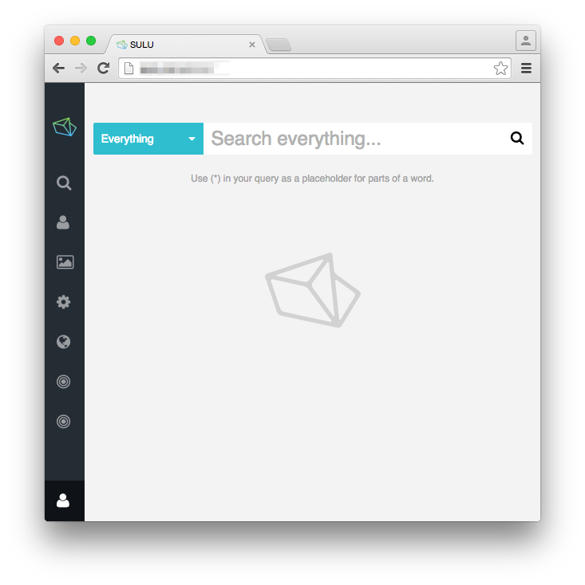
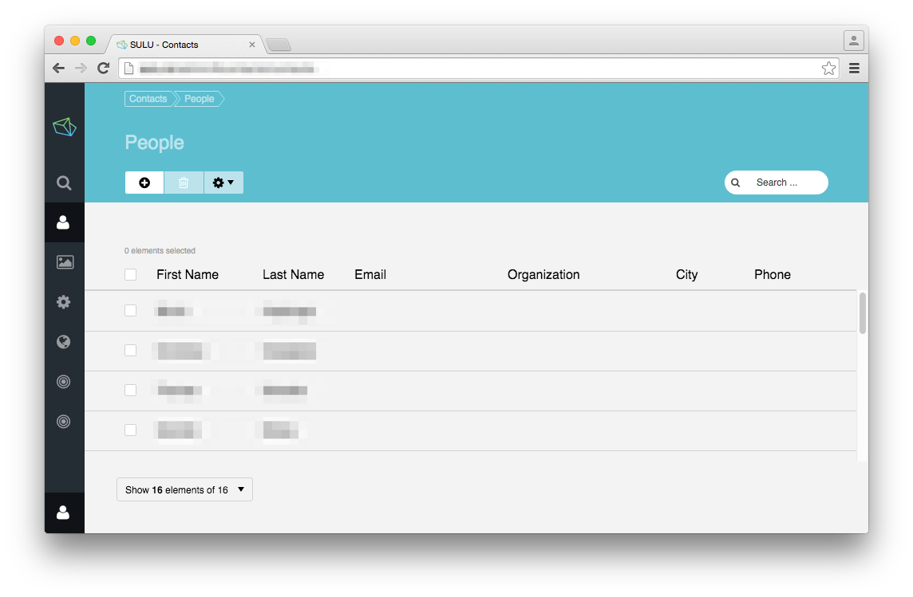
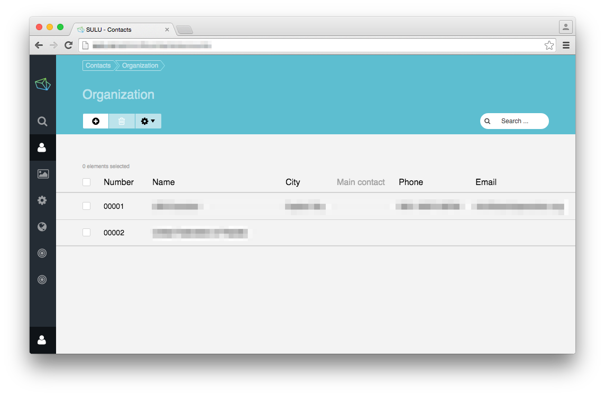
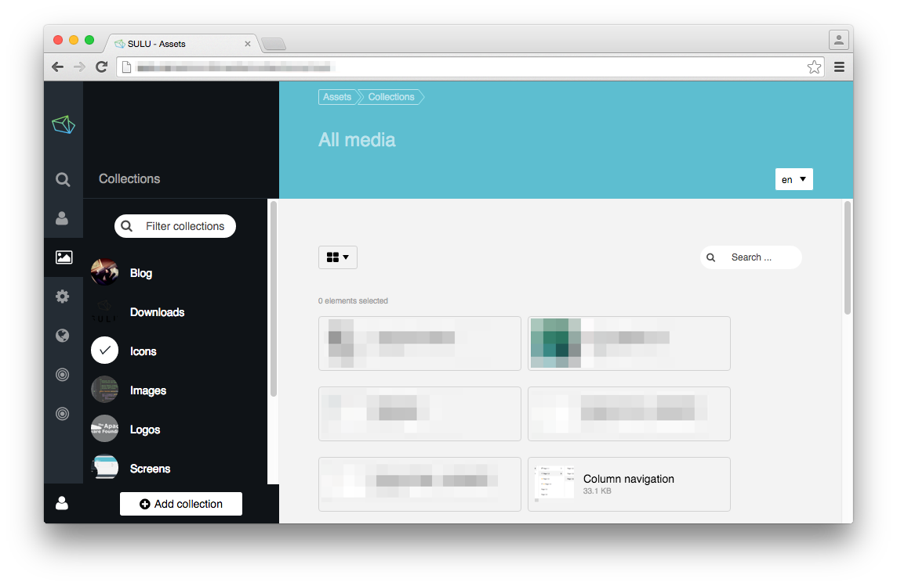
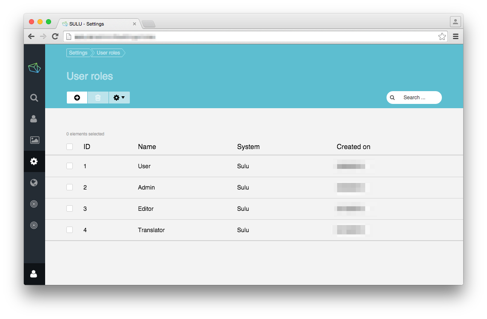
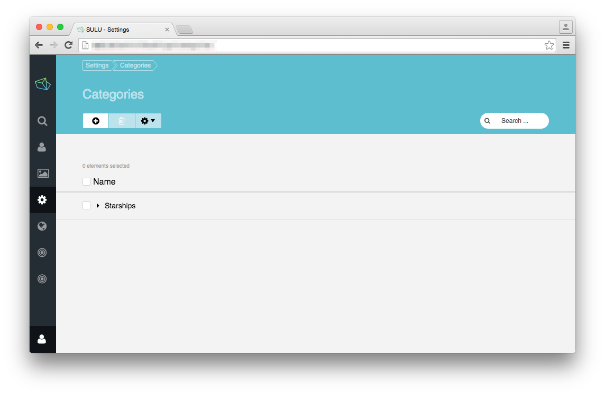
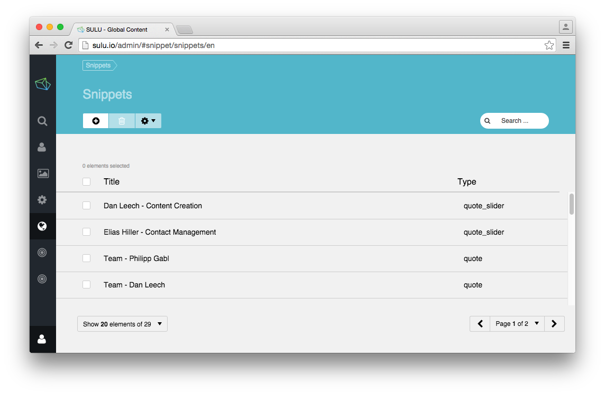
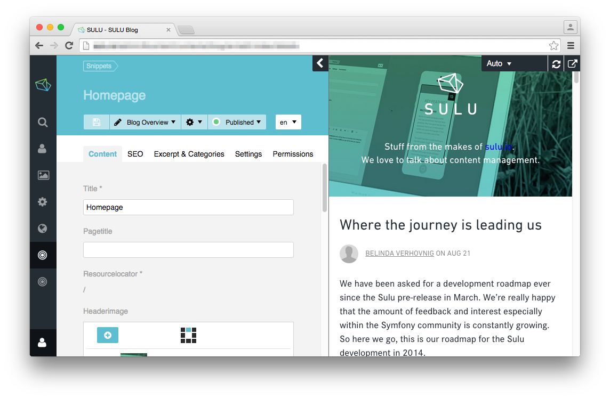

The Sulu Admin Interface
========================

In the last steps you setup your own Sulu website. The admin area should already be accessible.
It gives a nice impression of the features of Sulu. And that's just what this page does:
Give you a short glance on the Sulu admin interface. Everything else you'll learn by exploring
it. There won't be a dedicated documentation.

Dashboard
---------

We got big plans for the dashboard, but at the moment it gives you a starting point with the
implemented search. Just enter whatever you want to work on and it will give you direct links.

Contacts
--------

Contacts on the one hand cover the handling of personal informations on the other hand they are also
the user provider for Sulu Users.

You're also able to create organizations and connect people with them.

Assets
------

Sulu saves assets like images or downloadable files in a global pool. They could be shared
throughout webspaces.

Settings
--------

In the settings section, stuff that is closer to the system is defined. We got user roles,
categories, tags and the cache.

User Roles
^^^^^^^^^^

You could define several roles. The admin interface looks like this:

Categories
^^^^^^^^^^

You could categorize stuff with categories.

Tags
^^^^

Sulu also got a tagging system.

Snippets
^^^^^^^^

A Snippet is a global piece of content, that could be used in every webspace.

Content
-------

The main part of the administration area is the content.
You could edit whatever you defined before.
Though it is not the biggest part on this page, this is where Sulu happens.

Profile
-------
You could edit the personal information of your user in this section.

.. figure:: ../img/admin-profile.png
	:align: center

Now you should have an overview on what Sulu could provides and how it looks. There's one
last step to get started: :doc:`vhost` and then we are ready to create a basic website.

