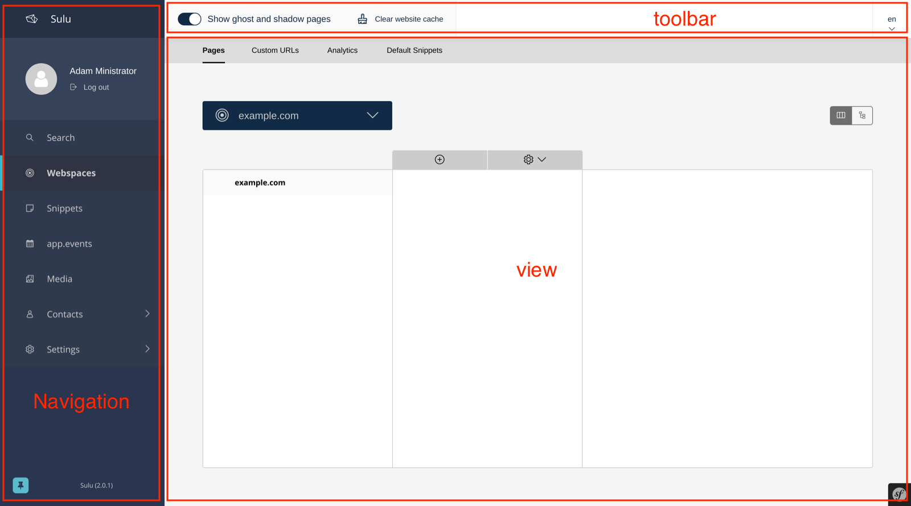
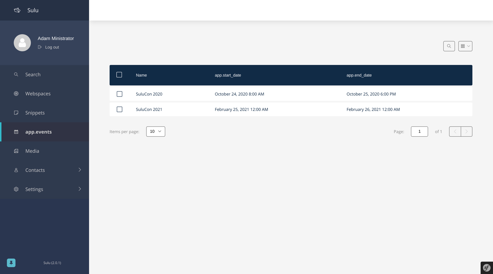
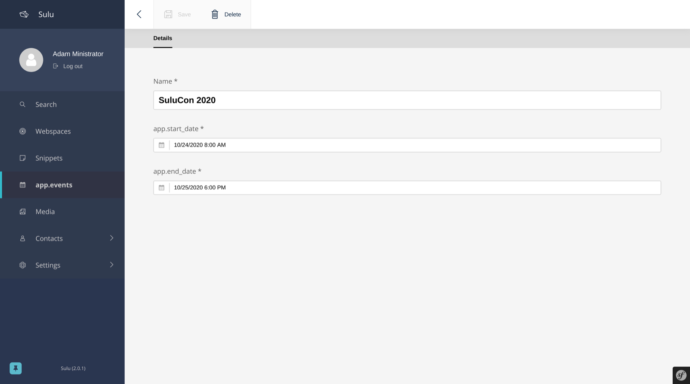
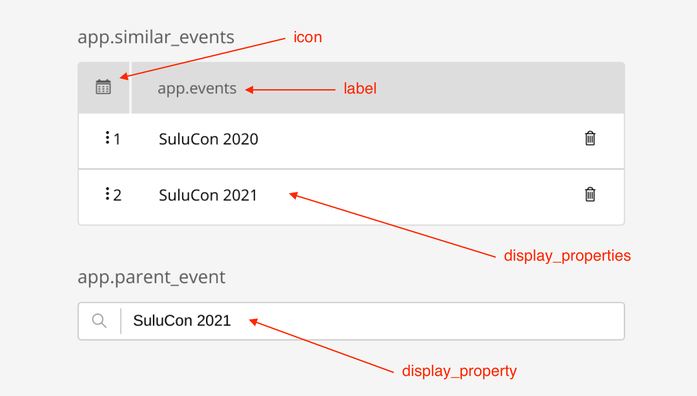

Extend Admin UI
===============

The final section of the book has a deeper look at how to integrate your own entities and corresponding views into the
Sulu administration interface. This includes adding new items to the navigation and configuring list views and form
views for your entity.

.. note::

    The `Sulu workshop`_ is a great supplementary resource to this document.
    It consists of 12 assignments that guide you through creating a small website that integrates two simple custom
    entities.
    Additionally, the `Sulu Demo repository`_ contains multiple pull requests that demonstrate how to extend different
    parts of the administration interface using simple examples.

Sulu is built with extensibility as a core value and allows the integration of a custom entity without writing any
JavaScript code in most cases. In order to provide this extensibility in a simple way, Sulu requires the APIs used for
managing the entities follow some rules. If you provide such an API, Sulu comes with a variety of existing frontend
views and components that cover a lot of different use cases. Furthermore, once you have reached the limits of the
existing components, Sulu provides various extension points of different granularity allowing you to hook into most
areas of the system using custom JavaScript code. A description of the JavaScript views, services and components of
the administration interface frontend and its extension points is available in the `Sulu Javascript Docs`_.

As stated above, the frontend components coming with Sulu expect that your APIs deliver the data for the administration
interface to match a certain standard. These standards affect the data for the list and form views that will be used to
manage your entity. Sulu uses the `FOSRestBundle`_ internally to build the REST APIs for the preexisting entities, but
the data format expected by the frontend components is completely architecture agnostic and library independent.
Therefore Sulu does not enforce how to actually implement the API for your entity - you can try to keep your code as
simple as possible by following the `Symfony Best Practices`_, go full `DDD`_ or anything between.

The following sections will list the requirements for your API to be compatible with the Sulu frontend components.
To keep things practical, the sections will use a custom Event entity as an example.

First of all, Sulu expects your API to expose the standard REST actions. In the case of our ``EventController`` this
means there has to be a ``POST`` action for creating events, a ``PUT`` action for modifying events, a ``DELETE`` action
for deleting events and finally a ``GET`` action for retrieving information about an event. The ``POST``, ``PUT`` and
``GET`` actions accept and return a JSON serialization of the event entity. The serialization could look something
like this:

.. code-block:: json

    {
        "id": 1,
        "name": "Sulu Con 2020",
        "startDate": "2020-10-24T08:00:00",
        "endDate": "2020-10-25T18:00:00"
    }

A JSON object like this can be sent to the ``POST`` action (without the ID) to create a new event or to the ``PUT``
action to update an existing event. Both of the previous actions must return a response in the same format as the
``GET`` action.

Furthermore, Sulu expects the URLs of your API to follows certain rules. All these actions are encapsulated behind the
same URL, in the event case e.g. ``/admin/api/events``. This endpoint returns a paginated list of available entities
when it receives a ``GET`` request and creates a new event when it receives a ``POST`` request with a JSON object like
shown above.

There has to be a sub URL including the ID for single events as well. E.g. the URL ``/admin/api/events/5`` represents
the event with the ID 5. This endpoint will accept a ``GET`` request to return a JSON object like above, a ``PUT``
request to update the event using a JSON object and a ``DELETE`` request to delete the event (this one does not need
any data).

For your own entities you only have to implement the actions you really need. E.g. if you have an entity that cannot be
deleted afterwards, then you don't have to implement the ``DELETE`` action. However, then you have also to make sure
that you don't activate any deletion functionality in the administration interface.

List configuration and controller
---------------------------------

This section assumes that you have a ``RestController`` with some actions already located at
``src/Controller/Admin/EventController`` and will add a ``cgetAction``. After finishing the action will be tied to the
``/admin/api/events`` endpoint, and should return a paginated list.

The list integrated in Sulu comes already with quite some features, including pagination, search, sorting and so on.
However, these functionalities also have to be implemented by the REST API the list talks to. Since it would be quite
some work to implement this for every REST API you are offering, we have build an abstraction that is doing that for
you in a very efficient manner. This abstraction is called ``ListBuilder``, and uses some metadata to generate queries.
It will only join tables that are absolutely necessary for the result of the query and is also capable of filtering,
sorting, searching and so on. Apart from that responses created with the ``ListBuilder`` will already match the
conventions required by the list in the administration interface.

Let's assume that we have this very simplified entity enriched with `doctrine annotations`_ already available at
``src/Entity/Event.php``:

.. code-block:: php

    <?php

    namespace App\Entity;

    use Doctrine\ORM\Mapping as ORM;

    /**
     * @ORM\Entity
     */
    class Event
    {
        const RESOURCE_KEY = 'events';

        /**
         * @ORM\Id()
         * @ORM\GeneratedValue()
         * @ORM\Column(type="integer")
         */
        private $id;

        /**
         * @ORM\Column(type="string")
         */
        private $name;

        /**
         * @ORM\Column(type="datetime_immutable")
         */
        private $startDate;

        /**
         * @ORM\Column(type="datetime_immutable")
         */
        private $endDate;
    }

.. note::

    The `RESOURCE_KEY` constant uniquely identifies this entity, and will be explained in more detail later.

This entity already contains some information about how the entity is structured and which properties it is holding,
but that is not enough information to build a full-fledged list in Sulu. For this reason we need some additional
metadata, e.g. should each of the property be visible in the list by default, can the list be sorted based on this
property, should it be included in a search and so on. In addition to that it is also possible to define the header and
a type, which describes how to format the content (e.g. a type of `datetime` will make sure that the date is displayed
correctly based on the localization of the user).

XML files are used to define this metadata. By default, these list configuration XML files are located in the
``config/lists`` directory of your project and an example looks like this:

.. code-block:: xml

    <?xml version="1.0" ?>
    <list xmlns="http://schemas.sulu.io/list-builder/list">
        <key>events</key>

        <properties>
            <property name="id" visibility="no" translation="sulu_admin.id">
                <field-name>id</field-name>
                <entity-name>App\Entity\Event</entity-name>
            </property>

            <property name="name" visibility="always" searchability="yes" translation="sulu_admin.name">
                <field-name>name</field-name>
                <entity-name>App\Entity\Event</entity-name>
            </property>

            <property name="startDate" visibility="yes" translation="app.start_date" type="datetime">
                <field-name>startDate</field-name>
                <entity-name>App\Entity\Event</entity-name>
            </property>

            <property name="endDate" visibility="yes" translation="app.end_date" type="datetime">
                <field-name>endDate</field-name>
                <entity-name>App\Entity\Event</entity-name>
            </property>
        </properties>
    </list>

The root tag is called ``list`` and has two sub tags: The ``key`` tag contains a key that must be unique among all
defined lists. Usually it is a safe bet to just reuse the above ``RESOURCE_KEY`` constant of the ``Event`` entity,
unless you want to have different lists for the same entity.

Afterwards the ``properties`` tag lists all properties available in this list. Each property is described by a
``property`` tag. These tags consist of a few attributes:

- The ``name`` attribute defines the name of the property in the representation returned by the ``ListBuilder``.
- The ``visibility`` attribute allows to define if the property can be excluded from the list and if it is shown by
  default. A value of ``yes`` or ``no`` only describes if it is shown by default, but the setting can be changed by the
  user. ``never`` and ``always`` do the same, but the don't allow the user of the system to change this settings.
- The ``translation`` attribute takes a translation key, which is resolved by the `Symfony Translations component`_ and
  uses this value as the header for the given column in the list. All translations are taken from the ``admin``
  translation domain, so make sure that the file is called something like ``admin.en.json``.
- The ``searchability`` attribute describes if the value of this property is used by the search field in the list.
- Finally the ``type`` attribute allows to define how to display the content of this property. In the above example it
  is used to display the datetime value in the localization of the user. There is a ``listFieldTransformerRegistry``
  extension point for these types, which allows to add more of them via JS.

In addition to these attributes the ``property`` tag has some sub tags as well. This includes the ``field-name``
telling the ``ListBuilder`` how the column holding the value in the database is called, and the ``entity-name``
describing which entity holds the property. Based on this information the ``ListBuilder`` can build a very efficient
query.

The ``Controller`` returning the data from the ``ListBuilder`` uses the `FOSRestBundle`_ as well. The ``cgetAction``
calls the ``FieldDescriptorFactory`` to load the information written in the above XML file. It then uses the
``DoctrineListBuilderFactory`` to get an instance of a ``DoctrineListBuilder``, which implements the logic to load data
in an efficient way from the database. The ``RestHelper`` helps to set certain parameters of the ``ListBuilder`` from
the HTTP request, so that this code has not been copied over multiple times. Finally the ``PaginatedRepresentation``
takes care of building an object representing the loaded data and enhance it with information like how many results
exist in total. This object will be serialized by the ``handleView`` method of the `FOSRestBundle`_. The following code
shows a controller doing what has just been described.

.. code-block:: php

    <?php

    namespace App\Controller\Admin;

    use App\Entity\Event;
    use FOS\RestBundle\Controller\Annotations\RouteResource;
    use FOS\RestBundle\Routing\ClassResourceInterface;
    use FOS\RestBundle\View\View;
    use FOS\RestBundle\View\ViewHandlerInterface;
    use Sulu\Component\Rest\ListBuilder\Doctrine\DoctrineListBuilderFactoryInterface;
    use Sulu\Component\Rest\ListBuilder\Metadata\FieldDescriptorFactoryInterface;
    use Sulu\Component\Rest\ListBuilder\PaginatedRepresentation;
    use Sulu\Component\Rest\RestHelperInterface;
    use Symfony\Component\HttpFoundation\Response;

    /**
     * @RouteResource("event")
     */
    class EventController implements ClassResourceInterface
    {
        private ViewHandlerInterface $viewHandler;

        private FieldDescriptorFactoryInterface $fieldDescriptorFactory;

        private DoctrineListBuilderFactoryInterface $listBuilderFactory;

        private RestHelperInterface $restHelper;

        public function __construct(
            ViewHandlerInterface $viewHandler,
            FieldDescriptorFactoryInterface $fieldDescriptorFactory,
            DoctrineListBuilderFactoryInterface $listBuilderFactory,
            RestHelperInterface $restHelper
        ) {
            $this->viewHandler = $viewHandler;
            $this->fieldDescriptorFactory = $fieldDescriptorFactory;
            $this->listBuilderFactory = $listBuilderFactory;
            $this->restHelper = $restHelper;
        }

        public function cgetAction(): Response
        {
            $fieldDescriptors = $this->fieldDescriptorFactory->getFieldDescriptors(Event::RESOURCE_KEY);
            $listBuilder = $this->listBuilderFactory->create(Event::class);
            $this->restHelper->initializeListBuilder($listBuilder, $fieldDescriptors);

            $listRepresentation = new PaginatedRepresentation(
                $listBuilder->execute(),
                Event::RESOURCE_KEY,
                $listBuilder->getCurrentPage(),
                $listBuilder->getLimit(),
                $listBuilder->count()
            );

            return $this->viewHandler->handle(View::create($listRepresentation));
        }
    }

Register your new Controller in the ``config/routes_admin.yaml`` file the following way:

.. code-block:: yaml

    app_events_api:
        type: rest
        prefix: /admin/api
        resource: App\Controller\Admin\EventController
        name_prefix: app.

Configure resources
-------------------

At this point the controller should register its actions already as routes. If you have already created other actions
as well, then you should be able to see these actions when using the ``debug:router`` command from Symfony:

.. code-block:: bash

    $ bin/adminconsole debug:router | grep event
      app.get_events     GET      ANY      ANY    /admin/api/events.{_format}
      app.post_event     POST     ANY      ANY    /admin/api/events.{_format}
      app.get_event      GET      ANY      ANY    /admin/api/events/{id}.{_format}
      app.put_event      PUT      ANY      ANY    /admin/api/events/{id}.{_format}
      app.delete_event   DELETE   ANY      ANY    /admin/api/events/{id}.{_format}

These routes are spread over two different URLs, one without the ID (``/admin/api/events``) and one with the ID
(``/admin/api/events/{id}``). The first one is used to get a list of available events and to create new events, while
the latter is about already existing events.

The question is how to pass this information now to our administration JS application. One way would have been to
separately pass a ``getAction``, a ``postAction``, a ``deleteAction`` and so on to every part of the application that
needs something like this. This would be a bit tedious, therefore we decided to introduce a concept called resources.
Every resource is identified by a unique key, which we added as a constant to the ``Event`` entity above. So our
example uses ``events`` as the resource key. A list URL (``/admin/api/events``) and/or a detail URL
(``/admin/api/events/{id}``) will be assigned to every resource key. Afterwards the resource key can be used in
multiple places, without worrying about which exact actions have to be used.

This is done by using the ``sulu_admin.resources`` configuration. The following configuration can be placed e.g. in the
`/config/packages/sulu_admin.yaml` file of your project:

.. code-block:: yaml

    sulu_admin:
        resources:
            events:
                routes:
                    list: app.get_events
                    detail: app.get_event

The configuration makes use of the route names you have seen listed above by the `debug:router` command. For both
variants of the URL (``/admin/api/events`` and ``/admin/api/events{id}``) one representative is used as a proxy for the
list and detail URL - whereby the detail URL has to be the one including the ID.

Admin class
-----------

After having registered the ``events`` resource, we can continue to include the events in the administration interface.
This is not done via a configuration, but in a separate ``Admin`` class. These ``Admin`` classes are registered as
services and collected by the system using `tags`_, which in turn calls their methods. This approach has the advantage
that you can use other services when adding stuff to the administration interface.

The two most important hooks are for views and navigation items.

Views are `React`_ components, whereby Sulu comes with
a few of them predefined. These predefined views can be configured via certain options, so that they are reusable in
different contexts. Such a view takes most of the space of the screen, the only things being excluded from it being the
toolbar on the very top of the screen and the navigation on the left.

Navigation items allow to add an item to the navigation on the left. Therefore they have to describe the title of this
item and where to navigate when the user clicks on the item.

The ``EventAdmin`` class can be located e.g. at the `/src/Admin` folder of your project. The two important methods are
called ``configureNavigationItems`` and ``configureViews``. The following example omits the implementation for these
methods, but it will be already correctly registered in the service container of Symfony without any configuration
because of the autoconfigure feature of Symfony:

.. code-block:: php

    <?php

    namespace App\Admin;

    use Sulu\Bundle\AdminBundle\Admin\Admin;
    use Sulu\Bundle\AdminBundle\Admin\Navigation\NavigationItemCollection;
    use Sulu\Bundle\AdminBundle\Admin\View\ViewBuilderFactoryInterface;
    use Sulu\Bundle\AdminBundle\Admin\View\ViewCollection;

    class EventAdmin extends Admin
    {
        private ViewBuilderFactoryInterface $viewBuilderFactory;

        public function __construct(ViewBuilderFactoryInterface $viewBuilderFactory)
        {
            $this->viewBuilderFactory = $viewBuilderFactory;
        }

        public function configureNavigationItems(NavigationItemCollection $navigationItemCollection): void
        {
            // add navigation items
        }

        public function configureViews(ViewCollection $viewCollection): void
        {
            // add views
        }
    }

Configure list view
-------------------

Views are the most important administration concept in Sulu. In JS a so called ``ViewRegistry`` exists, where a mapping
from a `React`_ component to a string is established. This string can be used as a key when defining views in the
previously mentioned ``Admin`` classes. Therefore a ``View`` class in PHP exists, which requires at least a ``name``, a
``path`` and a ``type``. The ``name`` must be unique and is e.g. used to reference this specific view in different
places, e.g. for the routing in the JS application. The ``path`` defines under which URL this view is displayed, and
the ``type`` is the reference to the React component in the ``ViewRegistry``.

Additionally the ``View`` class also has a ``setOption`` method, which allows to configure the ``View``. This allows us
to build the predefined views mentioned above. So the behavior of views can be influenced by these options, so we can
e.g. tell a view representing a list to load a different type of resource and reuse a lot of logic, instead of
implementing these things twice. And it allows you to build nice lists with a lot of features being consistent in the
entire system without touching a single line of JS.

However, directly using the ``View`` class does not really offer a nice developer experience, because this class cannot
really validate anything. It has to accept everything, because Sulu does not know what views will be registered in the
future. For this reason the concept of ``ViewBuilders`` has been introduced. As the name suggests it is an
implementation of the `Builder pattern`_, and provides a better interface to build specific views. For this purpose a
builder for each type of view has been implemented, which can consider the options required for each view. All of them
have in common that they share a ``getView`` method, which return a ``View`` object with the correctly set options. This
function can also validate the input and throw proper ``Exceptions`` in case some option does not make any sense.

All of these ``ViewBuilders`` are created by the ``ViewBuilderFactory``, which is a service that has already been
injected in the code example of the ``Admin`` class above. The minimum code to only show a list with already existing
items looks like this:

.. code-block:: php

    <?php

    namespace App\Admin;

    use App\Entity\Event;
    use Sulu\Bundle\AdminBundle\Admin\Admin;
    use Sulu\Bundle\AdminBundle\Admin\View\ViewBuilderFactoryInterface;
    use Sulu\Bundle\AdminBundle\Admin\View\ViewCollection;

    class EventAdmin extends Admin
    {
        const EVENT_LIST_VIEW = 'app.events_list';

        private ViewBuilderFactoryInterface $viewBuilderFactory;

        public function __construct(ViewBuilderFactoryInterface $viewBuilderFactory)
        {
            $this->viewBuilderFactory = $viewBuilderFactory;
        }

        // ...

        public function configureViews(ViewCollection $viewCollection): void
        {
            $listView = $this->viewBuilderFactory->createListViewBuilder(static::EVENT_LIST_VIEW, '/events')
                ->setResourceKey(Event::RESOURCE_KEY)
                ->setListKey('events')
                ->addListAdapters(['table']);

            $viewCollection->add($listView);
        }
    }

The ``createListViewBuilder`` method returns a ``ListViewBuilder``, which already knows which type of view it needs.
Therefore we only need to name the view (``app.events_list`` in this example), and tell Sulu on which URL it should be
rendered (``/events``). Then the previously defined resource key from the `Configure resources`_ section and the list
key from the XML in the `List configuration and controller`_ section are defined. The list adapters define how the list
shows the content it has loaded. There is a ``listAdapterRegistry`` JS extension point to register adapter, but for
now we use the ``table`` adapter, which makes use of an HTML table element.

Finally the ``View`` object has to be added to the ``ViewCollection``, which is passed as the first parameter to the
``configureViews`` method. This has been implemented like this to allow other bundles to further manipulate views that
have already been added by bundles registered previously.

After that an empty list should appear on ``/admin/#/events``. But if you add some data to the ``event`` table it
should be listed:

Configure navigation
--------------------

The ``configureNavigationItems`` method is quite similar to the ``configureViews`` method. It passes an object of type
``NavigationItemCollection`` as first parameter, which can be used to add new ``NavigationItems`` resp. to manipulate
the ones that have already been added before.

The ``NavigationItem`` accepts a name as constructor parameter, which will also be used as translation key and
translated by the `Symfony Translations component`_. The other mandatory thing to set is the view, which is referenced
by the name used in the ``createListViewBuilder`` call in `Configure list view`_. With ``setIcon`` the icon shown right
next to the translation is defined, whereby every icon is referenced by a string. If the string starts with `su-`, then
our own icon font is used. However, if the Sulu icon font does not have a matching icon, then the prefix `fa-` can be
used to choose an icon from the `Font Awesome icon font`_. Finally ``setPosition`` allows to decide where to place that
``NavigationItem``. The items will be ordered by their position value.

.. code-block:: php

    <?php

    namespace App\Admin;

    use Sulu\Bundle\AdminBundle\Admin\Admin;
    use Sulu\Bundle\AdminBundle\Admin\Navigation\NavigationItem;
    use Sulu\Bundle\AdminBundle\Admin\Navigation\NavigationItemCollection;

    class EventAdmin extends Admin
    {
        const EVENT_LIST_VIEW = 'app.events_list';

        // ...

        public function configureNavigationItems(NavigationItemCollection $navigationItemCollection): void
        {
            $eventNavigationItem = new NavigationItem('app.events');
            $eventNavigationItem->setView(static::EVENT_LIST_VIEW);
            $eventNavigationItem->setIcon('su-calendar');
            $eventNavigationItem->setPosition(30);

            $navigationItemCollection->add($eventNavigationItem);
        }

        // ...
    }

Form configuration
------------------

The ``Form`` component in Sulu has the same problem as the ``List``: The metadata we have delivered so far (including
the list and doctrine annotations) are not enough to render an actual form. The most important information missing is
how to render the information. Doctrine already gives us some information about the type, e.g. that a certain property
is a string, but Sulu still does not know how to render this information. A string could represented e.g. in a simple
``input`` field, in a ``textarea`` or in a rich text editor. That is why we need more information in separate XML file.

Form configuration XML files are located in the ``config/forms`` directory of your project by default and look similar
to the following example:

.. code-block:: xml

    <?xml version="1.0" ?>
    <form xmlns="http://schemas.sulu.io/template/template"
        xmlns:xsi="http://www.w3.org/2001/XMLSchema-instance"
        xsi:schemaLocation="http://schemas.sulu.io/template/template http://schemas.sulu.io/template/form-1.0.xsd"
    >
        <key>event_details</key>

        <properties>
            <property name="name" type="text_line" mandatory="true" colspan="12">
                <meta>
                    <title>sulu_admin.name</title>
                </meta>
                <params>
                    <param name="headline" value="true"/>
                </params>
            </property>

            <property name="startDate" type="date" mandatory="true" colspan="12">
                <meta>
                    <title>app.start_date</title>
                </meta>
            </property>

            <property name="endDate" type="date" mandatory="true" colspan="12">
                <meta>
                    <title>app.end_date</title>
                </meta>
            </property>
        </properties>
    </form>

Since the problem is very similar to the ``List`` view, the metadata also looks quite similar. The root tag is called
``form`` this time, and the first sub tag is a ``key``, which has the same purpose as on lists: Uniquely identify
metadata for a form. Since many resources consist of many tabs in the administration interface there can potentially be
many forms for every resource. Therefore the ``key`` is usually not only the same as the resource key, but a suffix is
added.

Afterwards every field showing up in this specific form will be listed as a ``property`` tag. Each of the properties
has a few attributes:

- ``name`` is the key in the JSON returned from the server, so usually the name from the property on the entity.
- ``type`` describes how to render the value of the given property and makes use of so called field types. Sulu has a
  ``fieldRegistry`` JS extension point containing all available field types.
- ``mandatory`` defines if the field is required in order for the form to be submitted.
- ``colspan`` allows to define the width of the field. A value of ``12`` means that the entire available width is used,
  using smaller numbers result in an accordingly smaller field.

.. note::

    To display current values, the JSON returned from the server must provide the value with a key that matches the ``name`` of the field.
    The format of the value of a field depends on the ``type`` of the field.
    In general, the values returned by the server should be in the same format as the values which are sent to the server when the form is saved.

The ``property`` tag also has some sub tags: The ``meta`` tag contains the ``title`` tag, which takes a translation key
and uses the `Symfony Translations component`_ to get the texts for the ``Form`` component.

.. note::

    If you do not want to use Symfony translations you can also pass a ``lang`` attribute to the ``title`` tag. In that
    case the passed string will be used for the given language as it is.

Furthermore the ``params`` tag can be used to customize the fields in certain ways. E.g. you see in the above XML that
the ``name`` property has a parameter called ``headline`` being set to ``true``. This will cause the field type
registered as ``text_line`` to render an ``input`` with a bigger font size. Every field type has its own set of
``params`` it will act on. You can have a look at our documentation at :doc:`../reference/content-types/index` to learn
more about them.

Configure form views
--------------------

In `Configure list view`_ you have already seen how to add a ``ListView``. The same has to be done now for the event
forms. We need to separately register two different forms, because the edit and create form have different paths.

However, both of these forms consist of two different views in our example. That's because Sulu allows to nest views as
well. You can assign a parent to each view, then this view will be rendered as child of its parent view (be aware that
the parent view must support this). In this case the parent view is a ``ResourceTabs`` view, which accepts multiple
children, whereby each of the children is shown as a separate tab. This example only makes use of a single tab, but if
you have multiple tabs you usually want to avoid that the same data is loaded over and over again every time you switch
between tabs. For this reason the responsibility of loading this data was moved to the ``ResourceTabs`` view. This view
will not be destroyed when switching between tabs, and therefore continues to hold the requested data from the server.

The child components of the ``ResourceTabs`` view will retrieve the data, and can make use of it without requesting it
again. For the events we use the ``Form`` view with the configuration already defined in `Form configuration`_. This
will render a form with all the fields defined in the XML file. It is also necessary to define some so called
``toolbarActions``. These define which buttons should appear in the top toolbar of Sulu while this view is shown. The
same concept is also in place for the ``List`` view. Similar to other parts of the system, there is a
``formToolbarActionRegistry`` and a ``listToolbarActionRegistry`` extension point that allow to register custom
toolbar actions that can be identified by a key string. In the ``Admin`` class the ``ToolbarAction`` class in
combination with the ``addToolbarActions`` method can be used to add elements to the toolbar. The ``ToolbarAction``
class takes the key used in the registry as first constructor parameter, and an optional array containing some
settings specific to the toolbar action as the second. There are also some sub classes of ``ToolbarAction``, e.g.
the ``DropdownToolbarAction``, which have more specific constructors.

The following code applies all of the mentioned concepts:

.. code-block:: php

    <?php

    namespace App\Admin;

    use App\Entity\Event;
    use Sulu\Bundle\AdminBundle\Admin\Admin;
    use Sulu\Bundle\AdminBundle\Admin\View\ToolbarAction;
    use Sulu\Bundle\AdminBundle\Admin\View\ViewBuilderFactoryInterface;
    use Sulu\Bundle\AdminBundle\Admin\View\ViewCollection;

    class EventAdmin extends Admin
    {
        const EVENT_FORM_KEY = 'event_details';
        const EVENT_LIST_VIEW = 'app.events_list';
        const EVENT_ADD_FORM_VIEW = 'app.event_add_form';
        const EVENT_EDIT_FORM_VIEW = 'app.event_edit_form';

        private ViewBuilderFactoryInterface $viewBuilderFactory;

        public function __construct(ViewBuilderFactoryInterface $viewBuilderFactory)
        {
            $this->viewBuilderFactory = $viewBuilderFactory;
        }

        public function configureViews(ViewCollection $viewCollection): void
        {
            $listView = $this->viewBuilderFactory->createListViewBuilder(static::EVENT_LIST_VIEW, '/events')
                ->setResourceKey(Event::RESOURCE_KEY)
                ->setListKey('events')
                ->addListAdapters(['table'])
                ->setAddView(static::EVENT_ADD_FORM_VIEW)
                ->setEditView(static::EVENT_EDIT_FORM_VIEW)
                ->addToolbarActions([new ToolbarAction('sulu_admin.add'), new ToolbarAction('sulu_admin.delete')]);

            $viewCollection->add($listView);

            $addFormView = $this->viewBuilderFactory->createResourceTabViewBuilder(static::EVENT_ADD_FORM_VIEW, '/events/add')
                ->setResourceKey(Event::RESOURCE_KEY)
                ->setBackView(static::EVENT_LIST_VIEW);

            $viewCollection->add($addFormView);

            $addDetailsFormView = $this->viewBuilderFactory->createFormViewBuilder(static::EVENT_ADD_FORM_VIEW . '.details', '/details')
                ->setResourceKey(Event::RESOURCE_KEY)
                ->setFormKey(static::EVENT_FORM_KEY)
                ->setTabTitle('sulu_admin.details')
                ->setEditView(static::EVENT_EDIT_FORM_VIEW)
                ->addToolbarActions([new ToolbarAction('sulu_admin.save'), new ToolbarAction('sulu_admin.delete')])
                ->setParent(static::EVENT_ADD_FORM_VIEW);

            $viewCollection->add($addDetailsFormView);

            $editFormView = $this->viewBuilderFactory->createResourceTabViewBuilder(static::EVENT_EDIT_FORM_VIEW, '/events/:id')
                ->setResourceKey(Event::RESOURCE_KEY)
                ->setBackView(static::EVENT_LIST_VIEW);

            $viewCollection->add($editFormView);

            $editDetailsFormView = $this->viewBuilderFactory->createFormViewBuilder(static::EVENT_EDIT_FORM_VIEW . '.details', '/details')
                ->setResourceKey(Event::RESOURCE_KEY)
                ->setFormKey(static::EVENT_FORM_KEY)
                ->setTabTitle('sulu_admin.details')
                ->addToolbarActions([new ToolbarAction('sulu_admin.save'), new ToolbarAction('sulu_admin.delete')])
                ->setParent(static::EVENT_EDIT_FORM_VIEW);

            $viewCollection->add($editDetailsFormView);
        }
    }

The first thing that changed compared to the previous listing of the ``Admin`` class is that a few function calls to
the ``ListViewBuilder`` have been added. The ``setAddView`` and ``setEditView`` calls define to which views this list
is linked. The edit view is used when an element in the list is clicked. The ``List`` view will append the ID and
navigate to this view. The add view is similar, but is used when the toolbar action with the key ``sulu_admin.add`` is
clicked. This action is added using the ``addToolbarActions`` call along with the ``sulu_admin.delete`` toolbar action,
which allows to delete selected items from the list.

The views for the add and edit form look quite similar, except for the URLs they are using. Both of them make use of
the ``createResourceTabViewBuilder`` call returning a ``ResourceTabViewBuilder``. Setting the ``resourceKey`` for this
view is mandatory, so that it knows which resource it should load. In the edit view we also define an ``:id`` parameter
in the path. Parameters are prefixed with a colon, and views can access their values. This way the ``ResourceTabs``
know which resource it has to load. If a ``backView`` is set a back button appears in the toolbar, which navigates to
the given view.

Both ``Form`` views created by the ``createFormViewBuilder`` call look very similar as well. They need two different
keys: The ``resourceKey`` to load the correct resource for the form and the ``formKey`` to know which form fields to
display.

.. note::

    Splitting into ``resourceKey`` and ``formKey`` does not seem to make a lot sense in this example, but if you have
    bigger resources it might make sense to spread the fields over multiple different tabs, each showing a different
    form.

The forms also get a ``tabTitle``, which is a translation key being used as the title of a tab after it has been
translated. The ``addToolbarActions`` method adds the save and delete buttons. Then the form is attached to the correct
``ResourceTabs`` view by setting it as their parent. Mind that the path of the forms only contains the part specific
to this tab. The path of the parent will be automatically prepended.

The only other difference between the add and edit form is that the add form needs to know where to navigate after the
resource has been successfully created. That is what the ``setEditView`` call is doing, which usually shows to the
corresponding edit form.

While it mostly does not make any sense to have multiple tabs in an add form (because Sulu will reset data when
switching between tabs) it is possible to add multiple edit form tabs to the ``ResourceTabs`` by adding more views with
the same ``parent``. The main use cases for this are splitting a single resource into multiple tabs (use the same
``resourceKey`` but different ``formKey``) or if a resource has some sub resources (there is e.g. also the
``FormOverlayList`` view which suits that use case very well).

After successfully finishing the above steps you should be able to see the form you have configured when clicking the
edit icon in the list or if you click the add button in the toolbar:

Selection field type
--------------------

Most of the time it also makes sense for the resources resp. entities you are creating to be assigned at other places.
In the event example it could e.g. make sense to have a field to select similar events to the current one, in order to
show them on the website as well.

Since this is in our opinion a very important use case, we have tried to make creating such a field as easy as
possible. So, as with everything we have seen until now, it is not necessary to write a single line of JS in order to
make this work. Instead the concept of ``field_type_options`` exists, which allows to add additional field types based
on already existing ones customized by a certain set of options. Sulu comes with two abstract field types like this,
the ``selection`` and ``single_selection`` field type.

These two abstract field types can be registered using the `Symfony Configuration`_. The following configuration shows
how to register two field types, one for selecting a single and one for selecting multiple events.

.. code-block:: yaml

    sulu_admin:
        field_type_options:
            selection:
                event_selection:
                    default_type: 'list_overlay'
                    resource_key: 'events'
                    view:
                        name: 'app.event_edit_form'
                        result_to_view:
                            id: 'id'
                    types:
                        list_overlay:
                            adapter: 'table'
                            list_key: 'events'
                            display_properties:
                                - 'name'
                            icon: 'su-calendar'
                            label: 'app.events'
                            overlay_title: 'app.events'
            single_selection:
                single_event_selection:
                    default_type: 'list_overlay'
                    resource_key: 'events'
                    view:
                        name: 'app.event_edit_form'
                        result_to_view:
                            id: 'id'
                    types:
                        list_overlay:
                            adapter: 'table'
                            list_key: 'events'
                            display_properties:
                                - 'name'
                            icon: 'su-calendar'
                            empty_text: 'app.location.no_selections'
                            overlay_title: 'app.locations'
                        auto_complete:
                            display_property: 'name'
                            search_properties:
                                - 'name'

The ``field_type_options`` configuration key of the ``sulu_admin`` section is the one we need to set to register new
field types. The level below ``field_type_options`` are the names of the abstract field types, in our case
``selection`` and ``single_selection``. These are not the field types you can use, they only act as a boilerplate for
other field types.

These other field types are mentioned one level deeper, namely ``event_selection`` and ``single_event_selection``, and
these are the field types that can be used as value in the ``type`` attribute of the form XML. The parent configuration
key describes which abstract field type is used as a blueprint. The configuration below depends on which blueprint has
been chosen.

Both abstract field types support different types. The ``selection`` allows to use an auto complete field (used e.g. by
the ``tag_selection``), a full ``List`` component (e.g. ``category_selection``) or a list overlay (e.g.
``page_selection``). The ``single_selection`` has similar options: There is also a list overlay and auto complete type.
Additionally it also offers a ``single_select`` type, which makes use of a standard dropdown element.

Two things every of the mentioned types share is the ``resource_key`` configuration, since all of the options have to
load some resource. This is again the string that has already be defined e.g. in the entity in the
`List configuration and controller`_ section.

The ``default_type`` you see in both configuration sections defines which of the configured types (you can configure
multiple types and use a param in the form XML to switch between them) is used if not specified otherwise.

Optionally a `view` configuration can be set. This configuration allows to define a deep link to the resulting UI. There
are two differnent configuration values for the the `view` option: `name` describes the name of the view to link to,
which needs to be the same as defined in the `Admin` class. The `result_to_view` configuration describes how to
translate the properties from the result to the parameters of the route of the view. In many cases the `id` of the
property should be mapped to the `id` parameter of the route, as it is done in the above example.

Some of the other properties in the above ``list_overlay`` configuration have already been explained in different parts
of this guide. The ``adapter`` describes how to display the list and the ``list_key`` defines which list XML
configuration to use. In addition to them the ``display_properties`` defines which properties to show in the field type
itself, the ``icon`` describes what is shown on the add button opening the overlay, ``label`` is the translation key used
in the header of the field type and ``overlay_title`` is the translation for the title in the overlay. In the single
variant you have an ``empty_text`` instead of a ``label``, which is only displayed if nothing has been selected. This
is necessary because the element looks a bit different.

The ``auto_complete`` section has a ``display_property`` configuration (mind the singular naming) defining which
property of the selected resource is shown. The ``search_properties`` describe which of the properties from the
resource are used to filter by the entered auto complete text.

This configuration is all that is necessary to get a field type that can be used in the form XML. If we e.g. want to
add a selection for multiple events for similar events and an auto complete for selecting only one event representing
the parent then the ``/config/forms/event_details.xml`` would look like this:

.. code-block:: xml

    <?xml version="1.0" ?>
    <form xmlns="http://schemas.sulu.io/template/template"
        xmlns:xsi="http://www.w3.org/2001/XMLSchema-instance"
        xsi:schemaLocation="http://schemas.sulu.io/template/template http://schemas.sulu.io/template/form-1.0.xsd"
    >
        <key>event_details</key>

        <properties>
            <!-- ... -->

            <property name="similar_events" type="event_selection">
                <meta>
                    <title>app.similar_events</title>
                </meta>
            </property>

            <property name="parent_event" type="single_event_selection">
                <meta>
                    <title>app.parent_event</title>
                </meta>
                <params>
                    <param name="type" value="auto_complete" />
                </params>
            </property>
        </properties>
    </form>

.. note::

    This will show the fields in the form, but they will not properly save, because the REST API will not accept them
    yet. In order for this to be working you have to handle these fields in the REST API as well.

.. _FOSRestBundle: https://symfony.com/doc/master/bundles/FOSRestBundle/index.html
.. _Symfony Best Practices: https://symfony.com/doc/current/best_practices.html
.. _DDD: https://en.wikipedia.org/wiki/Domain-driven_design
.. _doctrine annotations: https://www.doctrine-project.org/projects/doctrine-orm/en/2.6/reference/annotations-reference.html
.. _Symfony Translations component: https://symfony.com/doc/current/translation.html
.. _tags: https://symfony.com/doc/current/service_container/tags.html
.. _React: https://reactjs.org/
.. _Builder pattern: https://en.wikipedia.org/wiki/Builder_pattern
.. _Font Awesome icon font: https://fontawesome.com/
.. _Symfony Configuration: https://symfony.com/doc/current/configuration.html
.. _Sulu workshop: https://github.com/sulu/sulu-workshop
.. _Sulu Demo repository: https://github.com/sulu/sulu-demo/pulls?q=is%3Aopen+is%3Apr+label%3AExample
.. _Sulu Javascript Docs: https://jsdocs.sulu.io/
