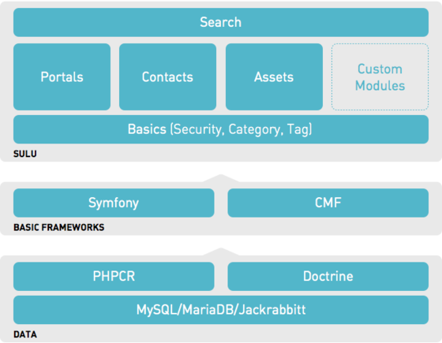

How Sulu is structured?
=======================

This graphic shows how the core of Sulu is setup.

Data
----

Symfony uses PHPCR, Doctrine and MySQL, MariaDB or Jackrabbit.

Basic Frameworks
----------------

Sulu is based on Symfony and the Symfony CMF.

Sulu
----

Everything else is Sulu. In the next step there is more information
about the components.