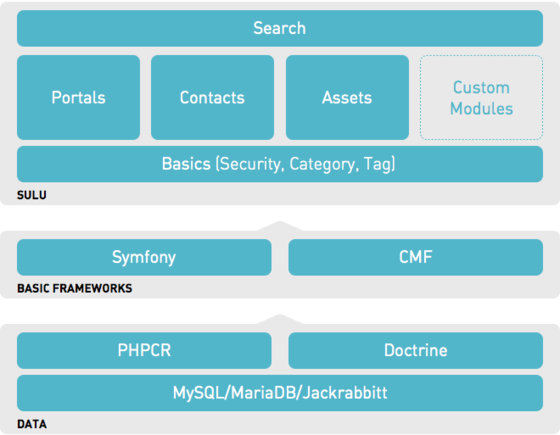

How is Sulu structured?
=======================

This graphic shows how the core of Sulu is set up.

Data
----

Sulu uses Doctrine ORM with MySQL, MariaDB, or PostgreSQL.

Basic Frameworks
----------------

Sulu is based on Symfony.

Sulu
----

Everything else is part of Sulu. The next section provides more information
about the components.