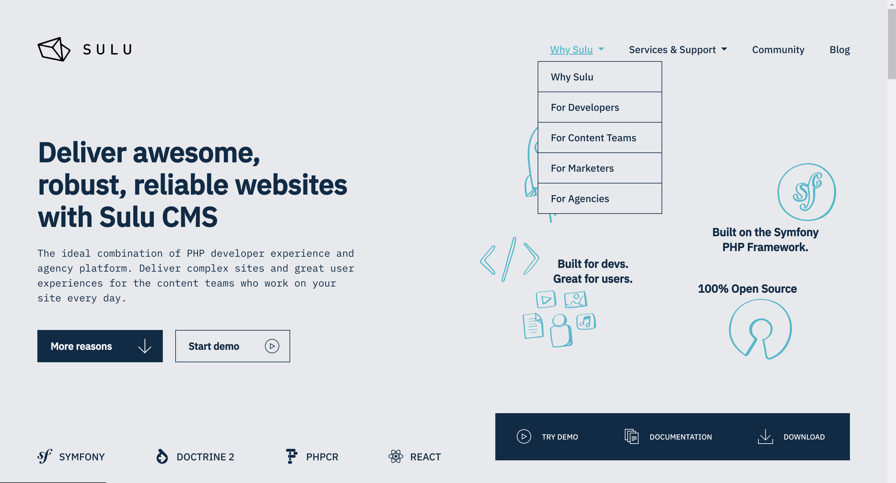

Navigation
==========

The navigation of a Sulu website is not hard-coded in the templates: the
content manager decides which pages are shown in which navigation, and the
developer renders it with the Twig functions shipped with Sulu.

Navigation Contexts
-------------------

A webspace defines so called navigation contexts in the ``navigation`` section
of its configuration (see :doc:`webspaces`). For many projects one or two
contexts are enough:

* The main navigation usually is the main entry point for the user of the
  website.
* A footer navigation can be useful for imprints and similar pages.

.. code-block:: xml

    <!-- config/webspaces/website.xml -->
    <navigation>
        <contexts>
            <context key="main">
                <meta>
                    <title lang="en">Mainnavigation</title>
                    <title lang="de">Hauptnavigation</title>
                </meta>
            </context>
            <context key="footer">
                <meta>
                    <title lang="en">Footer navigation</title>
                    <title lang="de">Fußzeilennavigation</title>
                </meta>
            </context>
        </contexts>
    </navigation>

The ``key`` of a context is what you pass to the Twig functions, the ``title``
is what the content manager sees: while editing a page, the contexts the page
belongs to are selected in *Settings > Navigation context*.

The following screenshot shows the `Sulu homepage`_ with the main navigation on
the top. As you can see the navigation returned for the navigation contexts are
not necessarily flat, but can also contain sub pages.

The navigation contexts can also be used in any other combination you want. The
separation into main and footer navigation is only a quite common example.

Rendering a Navigation
----------------------

The advantage of this method is that the content manager can decide on his own
which pages to show in the navigation. This code shows an example for creating
a nested navigation using all the pages marked to be shown in the main
navigation context, up to two levels deep:

.. code-block:: html+twig

    <ul>
        
        <li>
            <a href="{{ sulu_content_path(item.url) }}"
                title="{{ item.title }}">{{ item.title }}</a>
            
                <ul>
                
                    <li><a href="{{ sulu_content_path(child.url) }}"
                            title="{{ child.title }}">
                        {{ child.title }}
                    </a></li>
                
                </ul>
            
        </li>
        
    </ul>

Sulu ships Twig functions for the usual cases: the whole tree of a context
starting at the homepage (``sulu_page_navigation_root_tree``), a flat list of
it (``sulu_page_navigation_root_flat``), or the sub navigation of a given page
(``sulu_page_navigation_tree`` and ``sulu_page_navigation_flat``). Their
parameters and the data returned for every page are described in the
:doc:`Twig extensions reference <../reference/twig-extensions/index>`.

.. _Sulu homepage: https://sulu.io/
