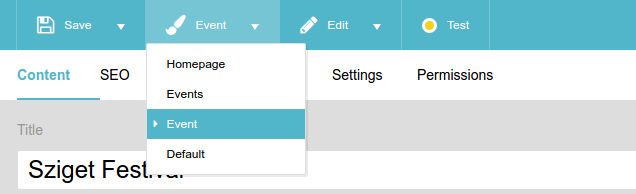
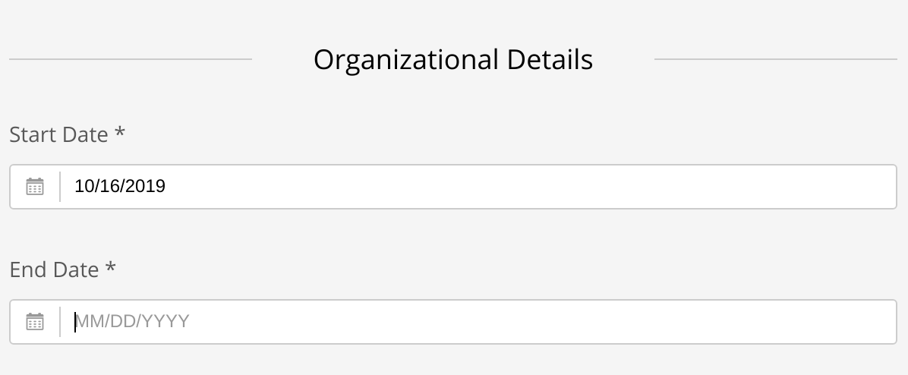
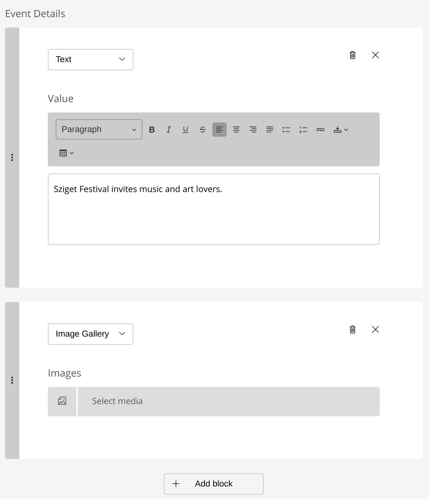
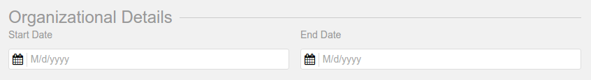

Creating a Page Template
========================

In Sulu, each page has a *page template*. The page template controls two things:

* the structure of the page
* how that structure is rendered

The structure of a page consists of *properties*, each of which has a *(content)
type*. The default page template, for example, defines the following
properties:

* **title** of type **text_line**
* **url** of type **resource_locator**
* **article** of type **text_editor**

When a content manager opens a page in the administration interface, they can
change the values of these properties. At last, frontend designers can access
these values and render them according to the desired design.

Each page template is defined by two files:

* an **XML file** that contains the page structure
* a **Twig file** that contains the HTML code

For example, the default template -- named "default" -- is defined by the files
``config/templates/pages/default.xml`` and
``templates/pages/default.html.twig``. The Sulu Skeleton
also contains a second template named "homepage", which you can find in the
same directories.

This guide focuses on the configuration of the page structure in the XML file.
If you want to learn more about rendering the pages in Twig, read
:doc:`twig`.

Choosing the Template of a Page
-------------------------------

The template of a page can be selected in the admin interface:

.. Caution::

    A template is shown in the dropdown only if both the XML and the Twig file
    exist! If you can't see your template, double-check the directories
    ``config/templates/pages`` and ``templates/pages``.

The name displayed in the dropdown is configured in the ``<meta>`` section of
the XML:

.. code-block:: xml

    <!-- config/templates/pages/default.xml -->
    <?xml version="1.0" ?>
    <template xmlns="http://schemas.sulu.io/template/template"
              xmlns:xsi="http://www.w3.org/2001/XMLSchema-instance"
              xsi:schemaLocation="http://schemas.sulu.io/template/template http://schemas.sulu.io/template/template-1.0.xsd">
        <!-- ... -->

        <meta>
            <title lang="en">Default</title>
        </meta>

        <!-- ... -->
    </template>

You can customize the text by changing this property.

Creating a Custom Template
--------------------------

In your projects, you will need several templates for different parts of your
website. The easiest way is to copy and adjust the default template.

The first thing you need to adjust is the ``<key>``. This is the unique
identifier of the template:

.. code-block:: xml

    <!-- config/templates/pages/event.xml -->
    <?xml version="1.0" ?>
    <template xmlns="http://schemas.sulu.io/template/template"
              xmlns:xsi="http://www.w3.org/2001/XMLSchema-instance"
              xsi:schemaLocation="http://schemas.sulu.io/template/template http://schemas.sulu.io/template/template-1.0.xsd">

        <key>event</key>

        <!-- ... -->
    </template>

.. caution::

    Currently the ``<key>`` has to be identical to the filename of the template
    minus the ``.xml`` suffix.

The second thing you have to customize is the ``<view>``. This element stores
the Twig file that is used to render the template:

.. code-block:: xml

    <!-- config/templates/pages/event.xml -->
    <?xml version="1.0" ?>
    <template xmlns="http://schemas.sulu.io/template/template"
              xmlns:xsi="http://www.w3.org/2001/XMLSchema-instance"
              xsi:schemaLocation="http://schemas.sulu.io/template/template http://schemas.sulu.io/template/template-1.0.xsd">
        <!-- ... -->

        <view>pages/event</view>

        <!-- ... -->
    </template>

.. Note::

    Sulu automatically adds the ``.<format>.twig`` suffix to the view string,
    depending on the format requested by the client (HTML, JSON, XML, ...).

    Instead of the folder notation with the ``/`` you can use the
    `Symfony's naming convention`_ without the file extension for Twig
    templates.

We'll talk more about the Twig file itself in :doc:`twig`. Let's continue with
adding properties to our page template.

Properties
----------

Properties make up the structure of a page. They are defined in the element
``<properties>``:

.. code-block:: xml

    <!-- config/templates/pages/event.xml -->
    <?xml version="1.0" ?>
    <template xmlns="http://schemas.sulu.io/template/template"
              xmlns:xsi="http://www.w3.org/2001/XMLSchema-instance"
              xsi:schemaLocation="http://schemas.sulu.io/template/template http://schemas.sulu.io/template/template-1.0.xsd">
        <!-- ... -->

        <properties>
            <!-- ... -->

            <property name="startDate" type="date">
                <meta>
                    <title lang="en">Start Date</title>
                </meta>
            </property>

            <!-- ... -->
        </properties>
    </template>

A property has three essential attributes:

* a ``name`` that is unique within a template
* a ``type`` that defines what kind of content can be stored
* a ``title`` that is shown in the administration interface

Here is a table with the content types shipped in Sulu core:

+------------------------------+---------------------------------------------+
| Key                          | Appearance in the administration            |
+==============================+=============================================+
| |text_line|                  | simple text input                           |
+------------------------------+---------------------------------------------+
| |text_area|                  | multiline text area                         |
+------------------------------+---------------------------------------------+
| |text_editor|                | text editor with formatting capabilities    |
+------------------------------+---------------------------------------------+
| |checkbox|                   | checkbox                                    |
+------------------------------+---------------------------------------------+
| |single_select|              | dropdown with options                       |
+------------------------------+---------------------------------------------+
| |select|                     | dropdown with multiple options              |
+------------------------------+---------------------------------------------+
| |color|                      | color picker                                |
+------------------------------+---------------------------------------------+
| |date|                       | date picker                                 |
+------------------------------+---------------------------------------------+
| |time|                       | text input with time validation             |
+------------------------------+---------------------------------------------+
| |url|                        | text input with URL validation              |
+------------------------------+---------------------------------------------+
| |email|                      | text input with email validation            |
+------------------------------+---------------------------------------------+
| |phone|                      | text input for a phone number               |
+------------------------------+---------------------------------------------+
| |page_selection|             | widget for selecting pages                  |
+------------------------------+---------------------------------------------+
| |single_page_selection|      | widget for selecting a single page          |
+------------------------------+---------------------------------------------+
| |smart_content|              | widget for configuring a data source        |
+------------------------------+---------------------------------------------+
| |resource_locator|           | widget for entering the URL of a page       |
+------------------------------+---------------------------------------------+
| |tag_selection|              | autocomplete input for entering and adding  |
|                              | tags                                        |
+------------------------------+---------------------------------------------+
| |category_selection|         | widget for selecting categories             |
+------------------------------+---------------------------------------------+
| |media_selection|            | widget for selecting media (images,         |
|                              | documents)                                  |
+------------------------------+---------------------------------------------+
| |single_media_selection|     | widget for a single media item (image,      |
|                              | document)                                   |
+------------------------------+---------------------------------------------+
| |contact_account_selection|  | widget for selecting contacts and accounts  |
+------------------------------+---------------------------------------------+
| |teaser_selection|           | widget for displaying content teasers       |
+------------------------------+---------------------------------------------+
| |snippet_selection|          | widget for selecting multiple snippets      |
+------------------------------+---------------------------------------------+
| |single_snippet_selection|   | widget for selecting a single snippet       |
+------------------------------+---------------------------------------------+
| |contact_selection|          | widget for selecting multiple contacts      |
+------------------------------+---------------------------------------------+
| |single_contact_selection|   | widget for selecting a single contact       |
+------------------------------+---------------------------------------------+
| |account_selection|          | widget for selecting multiple accounts      |
+------------------------------+---------------------------------------------+
| |single_account_selection|   | widget for selecting a single account       |
+------------------------------+---------------------------------------------+

.. tip::

    Use the command ``sulu:content:types:dump`` to list all the content types
    available in your project:

    .. code-block:: bash

        bin/adminconsole sulu:content:types:dump

Many content types can be configured by passing parameters in the element
``<params>``. For a single select, for example, you need to set the possible
choices:

.. code-block:: xml

    <!-- config/templates/pages/event.xml -->
    <?xml version="1.0" ?>
    <template xmlns="http://schemas.sulu.io/template/template"
              xmlns:xsi="http://www.w3.org/2001/XMLSchema-instance"
              xsi:schemaLocation="http://schemas.sulu.io/template/template http://schemas.sulu.io/template/template-1.0.xsd">
        <!-- ... -->
        <properties>
            <!-- ... -->

            <property name="eventType" type="single_select">
                <meta>
                    <title lang="en">Event Type</title>
                </meta>
                <params>
                    <param name="values" type="collection">
                        <param name="concert">
                            <meta>
                                <title lang="en">Concert</title>
                            </meta>
                        </param>
                        <param name="festival">
                            <meta>
                                <title lang="en">Festival</title>
                            </meta>
                        </param>
                    </param>
                </params>
            </property>

            <!-- ... -->
        </properties>
    </template>

More detail about the content types and their parameters can be found in the
:doc:`../reference/content-types/index`.

Mandatory/Optional Properties
-----------------------------

Properties are optional by default. If a content manager *must* fill out a
property, set the attribute ``mandatory`` to ``true``:

.. code-block:: xml

    <!-- config/templates/pages/event.xml -->
    <?xml version="1.0" ?>
    <template xmlns="http://schemas.sulu.io/template/template"
              xmlns:xsi="http://www.w3.org/2001/XMLSchema-instance"
              xsi:schemaLocation="http://schemas.sulu.io/template/template http://schemas.sulu.io/template/template-1.0.xsd">
        <!-- ... -->
        <properties>
            <!-- ... -->

            <property name="startDate" type="date" mandatory="true">
                <!-- ... -->
            </property>

            <!-- ... -->
        </properties>
    </template>

Visible/Disabled Conditions
---------------------------

It is possible to hide or disable specific properties based on the current values of
the template by setting the ``visibleCondition`` and ``disabledCondition`` attribute.

Inside of these attributes, you can utilize the `jexl`_ syntax for expressing your conditions.

.. code-block:: xml

    <!-- config/templates/pages/event.xml -->
    <?xml version="1.0" ?>
    <template xmlns="http://schemas.sulu.io/template/template"
              xmlns:xsi="http://www.w3.org/2001/XMLSchema-instance"
              xsi:schemaLocation="http://schemas.sulu.io/template/template http://schemas.sulu.io/template/template-1.0.xsd">
        <!-- ... -->

        <properties>
            <!-- ... -->

            <property name="isCode" type="checkbox">
                <!-- ... -->
            </property>

            <property name="code" type="text_area" visibleCondition="isCode == true">
                <!-- ... -->
            </property>

            <property name="image" type="single_media_selection" disabledCondition="isCode != true">
                <!-- ... -->
            </property>

            <!-- ... -->
        </properties>
    </template>

The ``isCode`` variable in these conditions is relative to the root of the form. If you want to check a property
relative from your position, you can use the nestable ``__parent`` variable. This is especially useful when working
from within a block.

.. code-block:: xml

    <!-- config/templates/pages/event.xml -->
    <?xml version="1.0" ?>
    <template xmlns="http://schemas.sulu.io/template/template"
              xmlns:xsi="http://www.w3.org/2001/XMLSchema-instance"
              xsi:schemaLocation="http://schemas.sulu.io/template/template http://schemas.sulu.io/template/template-1.0.xsd">
        <!-- ... -->

        <properties>
            <!-- ... -->

            <block name="blocks" default-type="editor" minOccurs="0">
                <meta>
                    <title lang="en">Content</title>
                    <title lang="de">Inhalte</title>
                </meta>

                <types>
                    <type name="editor">
                        <properties>
                            <property name="hasImage" type="checkbox">
                                <!-- ... -->
                            </property>

                            <property name="image" type="single_media_selection" visibleCondition="__parent.hasImage">
                                <!-- ... -->
                            </property>
                        </properties>
                    </type>
                </types>
            </block>
        </properties>
    </template>

.. note::

    Mind that you can call the ``__parent`` (something like ``__parent.__parent.hasImage``) variable multiple times if
    you use nested blocks.

.. note::

    Because the ``&`` character needs to be escaped inside of XML files, you have to use ``AND`` instead of ``&&`` 
    if you want to to connect conditions using a logical and. Additionally, you can use ``OR`` instead of ``||``.

Language Independent Properties
-------------------------------

Some content like article numbers or other metadata might be the same for every
language. In that case, you can mark properties as not multilingual using
``multilingual="false"``:

.. code-block:: xml

    <?xml version="1.0" ?>
    <template xmlns="http://schemas.sulu.io/template/template"
              xmlns:xsi="http://www.w3.org/2001/XMLSchema-instance"
              xsi:schemaLocation="http://schemas.sulu.io/template/template http://schemas.sulu.io/template/template-1.0.xsd">
        <!-- ... -->

        <properties>
            <!-- ... -->

            <property name="article_number" type="text_line" multilingual="false">
                <!-- ... -->
            </property>

            <!-- ... -->
        </properties>
    </template>

.. note::

    Changing the ``multilingual`` attribute of a property is similar to renaming the property.
    If you want to keep existing data for the property, you need to migrate it. Multilingual
    properties are saved with a name like ``i18n:de-article_number``, while non-multilingual
    properties use a name like ``article_number``.

Sections
--------

Properties can be grouped together in *sections*. Sections are visible in the
administration interface only and have no other effect on the data model:

A section is identified by its ``name``. This name is used for the anchor tag
in the administration interface.

As for properties, the label of the section goes into its ``<meta>`` tag:

.. code-block:: xml

    <!-- config/templates/pages/event.xml -->
    <?xml version="1.0" ?>
    <template xmlns="http://schemas.sulu.io/template/template"
              xmlns:xsi="http://www.w3.org/2001/XMLSchema-instance"
              xsi:schemaLocation="http://schemas.sulu.io/template/template http://schemas.sulu.io/template/template-1.0.xsd">
        <!-- ... -->
        <properties>
            <!-- ... -->

            <section name="organizationalDetails">
                <meta>
                    <title lang="en">Organizational Details</title>
                </meta>

                <!-- ... -->
            </section>

            <!-- ... -->
        </properties>
    </template>

The properties in the sections are nested in a separate element below the
section:

.. code-block:: xml

    <!-- config/templates/pages/event.xml -->
    <?xml version="1.0" ?>
    <template xmlns="http://schemas.sulu.io/template/template"
              xmlns:xsi="http://www.w3.org/2001/XMLSchema-instance"
              xsi:schemaLocation="http://schemas.sulu.io/template/template http://schemas.sulu.io/template/template-1.0.xsd">
        <!-- ... -->
        <properties>
            <!-- ... -->

            <section name="organizationalDetails">
                <!-- ... -->

                <properties>
                    <property name="startDate" type="date">
                        <meta>
                            <title lang="en">Start Date</title>
                        </meta>
                    </property>
                    <property name="endDate" type="date">
                        <meta>
                            <title lang="en">End Date</title>
                        </meta>
                    </property>
                </properties>
            </section>

            <!-- ... -->
        </properties>
    </template>

Content Blocks
--------------

Similar to sections, content blocks contain a list of fields. In content blocks,
however, the content managers themselves can add blocks of different types and
order them as they want:

Content blocks are defined with the ``<block>`` element. Like properties, they
have a name that is used to access their content in Twig. The label of the
content block is set in the ``<meta>`` element:

.. code-block:: xml

    <!-- config/templates/pages/event.xml -->
    <?xml version="1.0" ?>
    <template xmlns="http://schemas.sulu.io/template/template"
              xmlns:xsi="http://www.w3.org/2001/XMLSchema-instance"
              xsi:schemaLocation="http://schemas.sulu.io/template/template http://schemas.sulu.io/template/template-1.0.xsd">
        <!-- ... -->
        <properties>
            <!-- ... -->

             <block name="eventDetails">
                 <meta>
                     <title lang="en">Event Details</title>
                 </meta>

                 <!-- ... -->
             </block>

            <!-- ... -->
        </properties>
    </template>

The content managers can choose the type of each individual block from a
dropdown. Attention, we're not talking about content types! The users of
the administration interface don't even know what the quite technical concept of
a content type is.

Instead, you should think about your own types that make sense in your case.
In this particular example, we want to provide the following types to our users:

* "Text" for formatted text
* "Image Gallery" for a gallery of images
* "Quote" for a quote from an artist

We'll define these types in the ``<types>`` element and set the default type in
the ``default-type`` attribute:

.. code-block:: xml

    <!-- config/templates/pages/event.xml -->
    <?xml version="1.0" ?>
    <template xmlns="http://schemas.sulu.io/template/template"
              xmlns:xsi="http://www.w3.org/2001/XMLSchema-instance"
              xsi:schemaLocation="http://schemas.sulu.io/template/template http://schemas.sulu.io/template/template-1.0.xsd">
        <!-- ... -->
        <properties>
            <!-- ... -->

            <block name="eventDetails" default-type="text">
                <!-- ... -->

                <types>
                    <type name="text">
                        <meta>
                            <title lang="en">Text</title>
                        </meta>

                        <!-- ... -->
                    </type>

                    <type name="imageGallery">
                        <meta>
                            <title lang="en">Image Gallery</title>
                        </meta>

                        <!-- ... -->
                    </type>

                    <type name="quote">
                        <meta>
                            <title lang="en">Quote</title>
                        </meta>

                        <!-- ... -->
                    </type>
                </types>
            </block>

            <!-- ... -->
        </properties>
    </template>

Each of our types can be mapped to one or multiple properties. These properties
are shown in the administration interface when the content manager selects the
type:

.. code-block:: xml

    <!-- config/templates/pages/event.xml -->
    <?xml version="1.0" ?>
    <template xmlns="http://schemas.sulu.io/template/template"
              xmlns:xsi="http://www.w3.org/2001/XMLSchema-instance"
              xsi:schemaLocation="http://schemas.sulu.io/template/template http://schemas.sulu.io/template/template-1.0.xsd">
        <!-- ... -->
        <properties>
            <!-- ... -->

            <block name="eventDetails" default-type="text">
                <!-- ... -->

                <types>
                    <!-- ... -->

                    <type name="quote">
                        <!-- ... -->

                        <properties>
                            <property name="text" type="text_area">
                                <meta>
                                    <title lang="en">Text</title>
                                </meta>
                            </property>
                            <property name="author" type="contact_account_selection">
                                <meta>
                                    <title lang="en">Author</title>
                                </meta>
                            </property>
                        </properties>
                    </type>
                </types>
            </block>

            <!-- ... -->
        </properties>
    </template>

.. note::

    The challenge here is to mentally separate *block types* from *content
    types*. You define *block types* yourself in the ``<types>`` element
    and set the default selection in ``default-type``. Only from the
    ``<property>``, we reference a *content type*.

Aligning Fields on the Grid
---------------------------

Sulu's administration interface uses a basic twelve-column grid for the
properties. By default, each property is all the twelve columns wide. If you
reduce that width, properties automatically float next to each other if they fit
within the twelve columns:

The width of a property is configured in the ``colspan`` attribute:

.. code-block:: xml

    <!-- config/templates/pages/event.xml -->
    <?xml version="1.0" ?>
    <template xmlns="http://schemas.sulu.io/template/template"
              xmlns:xsi="http://www.w3.org/2001/XMLSchema-instance"
              xsi:schemaLocation="http://schemas.sulu.io/template/template http://schemas.sulu.io/template/template-1.0.xsd">
        <!-- ... -->
        <properties>
            <!-- ... -->

            <section name="organizationalDetails">
                <!-- ... -->

                <properties>
                    <property name="startDate" type="date" colspan="6">
                        <!-- ... -->
                    </property>

                    <property name="endDate" type="date" colspan="6">
                        <!-- ... -->
                    </property>
                </properties>
            </section>

            <!-- ... -->
        </properties>
    </template>

Displaying Additional Information for a Field
---------------------------------------------

You can display a help text with additional information for a property.
Put the help text into the ``<info_text>`` element in the ``<meta>`` section:

.. code-block:: xml

    <!-- config/templates/pages/event.xml -->
    <?xml version="1.0" ?>
    <template xmlns="http://schemas.sulu.io/template/template"
              xmlns:xsi="http://www.w3.org/2001/XMLSchema-instance"
              xsi:schemaLocation="http://schemas.sulu.io/template/template http://schemas.sulu.io/template/template-1.0.xsd">
        <!-- ... -->
        <properties>
            <!-- ... -->

            <property name="endDate" type="date">
                <meta>
                    <!-- ... -->

                    <info_text lang="en">
                        If the same as the start date, the event is treated as
                        one-day event.
                    </info_text>
                </meta>
            </property>

            <!-- ... -->
        </properties>
    </template>

Including Other Templates
-------------------------

If you want to reuse a portion of a template in a different template, you can
move the portion to a separate file and include it using `XInclude`_.

To enable XInclude, we'll first add the namespace
``xmlns:xi="http://www.w3.org/2001/XInclude"`` to our document:

.. code-block:: xml

    <!-- config/templates/pages/event.xml -->
    <?xml version="1.0" ?>
    <template xmlns="http://schemas.sulu.io/template/template"
              xmlns:xsi="http://www.w3.org/2001/XMLSchema-instance"
              xmlns:xi="http://www.w3.org/2001/XInclude"
              xsi:schemaLocation="http://schemas.sulu.io/template/template http://schemas.sulu.io/template/template-1.0.xsd">

        <!-- ... -->

    </template>

Now we can include the fragment in the template with the ``<xi:include>``
element:

.. code-block:: xml

    <!-- config/templates/pages/event.xml -->
    <?xml version="1.0" ?>
    <template xmlns="http://schemas.sulu.io/template/template"
              xmlns:xsi="http://www.w3.org/2001/XMLSchema-instance"
              xmlns:xi="http://www.w3.org/2001/XInclude"
              xsi:schemaLocation="http://schemas.sulu.io/template/template http://schemas.sulu.io/template/template-1.0.xsd">
        <!-- ... -->

        <xi:include href="fragments/event-properties.xml"/>

        <!-- ... -->
    </template>

.. note::

    The ``href`` contains a relative path to the included file.

The fragment itself should use a ``<template>`` or a ``<properties>`` element as root
to pass the XML schema validation in your IDE. In this example, we'll use a ``<properties>``
container:

.. code-block:: xml

    <!-- config/templates/pages/fragments/event-properties.xml -->
    <?xml version="1.0" ?>
    <properties xmlns="http://schemas.sulu.io/template/template"
                xmlns:xsi="http://www.w3.org/2001/XMLSchema-instance"
                xsi:schemaLocation="http://schemas.sulu.io/template/template http://schemas.sulu.io/template/template-1.0.xsd">

        <property name="startDate" type="date" mandatory="true">
            <!-- ... -->
        </property>

        <!-- ... -->
    </properties>

Including a Fragment of a Template
----------------------------------

If you want to pick single properties or sections of another template, use an
`XPointer`_. XPointers are similar to CSS selectors and match a specific part of
an XML document.

As example, imagine that you have a generic "Event" template and a more
specific "Concert" template that reuses the properties of the "Event" template.
Let's look at the "Event" template first:

.. code-block:: xml

    <!-- config/templates/pages/event.xml -->
    <?xml version="1.0" ?>
    <template xmlns="http://schemas.sulu.io/template/template"
              xmlns:xsi="http://www.w3.org/2001/XMLSchema-instance"
              xmlns:xi="http://www.w3.org/2001/XInclude"
              xsi:schemaLocation="http://schemas.sulu.io/template/template http://schemas.sulu.io/template/template-1.0.xsd">
        <!-- ... -->
        <properties>
            <!-- ... -->

            <property name="startDate" type="date" mandatory="true">
                <!-- ... -->
            </property>

            <!-- ... -->
        </properties>
    </template>

Nothing new here. To include these properties in the "Concert" template, pass
an XPointer that selects these elements in the ``xpointer`` attribute of the
``<xi:include>`` tag:

.. code-block:: xml

    <!-- config/templates/pages/concert.xml -->
    <?xml version="1.0" ?>
    <template xmlns="http://schemas.sulu.io/template/template"
              xmlns:xsi="http://www.w3.org/2001/XMLSchema-instance"
              xmlns:xi="http://www.w3.org/2001/XInclude"
              xsi:schemaLocation="http://schemas.sulu.io/template/template http://schemas.sulu.io/template/template-1.0.xsd">
        <!-- ... -->
        <properties>
            <!-- ... -->

            <xi:include href="event.xml"
                xpointer="xmlns(sulu=http://schemas.sulu.io/template/template)
                          xpointer(/sulu:properties/sulu:property)"/>

            <!-- ... -->
        </properties>
    </template>

The XPointer starts with the root element ``<properties>`` in the ``sulu``
namespace and selects all ``<property>`` children.

If you want to select an individual property with a specific name, that's
possible:

.. code-block:: xml

    <!-- config/templates/pages/concert.xml -->
    <?xml version="1.0" ?>
    <template xmlns="http://schemas.sulu.io/template/template"
              xmlns:xsi="http://www.w3.org/2001/XMLSchema-instance"
              xmlns:xi="http://www.w3.org/2001/XInclude"
              xsi:schemaLocation="http://schemas.sulu.io/template/template http://schemas.sulu.io/template/template-1.0.xsd">
        <!-- ... -->
        <properties>
            <!-- ... -->

            <xi:include href="event.xml"
                xpointer="xmlns(sulu=http://schemas.sulu.io/template/template)
                          xpointer(/sulu:properties/sulu:property[@name='startDate'])"/>

            <!-- ... -->
        </properties>
    </template>

This XPointer starts with the root element ``<properties>`` in the ``sulu``
namespace and selects all ``<property>`` children with the attribute ``name``
set to "startDate".

You can also match multiple elements of different types. Use the wildcard
``*`` for that:

.. code-block:: xml

    <!-- config/templates/pages/concert.xml -->
    <?xml version="1.0" ?>
    <template xmlns="http://schemas.sulu.io/template/template"
              xmlns:xsi="http://www.w3.org/2001/XMLSchema-instance"
              xmlns:xi="http://www.w3.org/2001/XInclude"
              xsi:schemaLocation="http://schemas.sulu.io/template/template http://schemas.sulu.io/template/template-1.0.xsd">
        <!-- ... -->
        <properties>
            <!-- ... -->

            <xi:include href="event.xml"
                xpointer="xmlns(sulu=http://schemas.sulu.io/template/template)
                          xpointer(/sulu:properties/*)"/>

            <!-- ... -->
        </properties>
    </template>

Caching
-------

Eventually you will start tweaking your pages for performance. Caching pages
on the client is one of the easiest performance improvements you can do.

You can configure a different caching strategy for each template. Add a
``<cacheLifetime>`` element with the number of seconds that your page should be
cached on the client:

.. code-block:: xml

    <!-- config/templates/pages/event.xml -->
    <?xml version="1.0" ?>
    <template xmlns="http://schemas.sulu.io/template/template"
              xmlns:xsi="http://www.w3.org/2001/XMLSchema-instance"
              xsi:schemaLocation="http://schemas.sulu.io/template/template http://schemas.sulu.io/template/template-1.0.xsd">
        <!-- ... -->

        <cacheLifetime type="seconds">2400</cacheLifetime>

        <!-- ... -->
    </template>

The cache lifetime will be sent to the client in the ``max-age`` field of the
``Cache-Control`` header. After the specified time, the cache will be
invalidated on the client. The next time the page is requested, the client will
send a new request to your server to update its cache.

.. caution::

    When you use client-side caching, be aware that there is no way to
    invalidate the client-side cache on demand. Prepare for having to wait
    for the given cache lifetime until all clients receive an updated version
    of your website. To shorten this time, it's generally a good idea not to set
    the cache lifetime too high.

There is a second ``type`` that you can use to specify the cache lifetime:
``expression``. With that type, you can pass the lifetime as `cron expression`_.
For example, if you know that your homepage changes its content each day at
8:00 AM, set the value to ``0 8 * * *``:

.. code-block:: xml

    <!-- config/templates/pages/event.xml -->
    <?xml version="1.0" ?>
    <template xmlns="http://schemas.sulu.io/template/template"
              xmlns:xsi="http://www.w3.org/2001/XMLSchema-instance"
              xsi:schemaLocation="http://schemas.sulu.io/template/template http://schemas.sulu.io/template/template-1.0.xsd">
        <!-- ... -->

        <cacheLifetime type="expression">0 8 * * *</cacheLifetime>

        <!-- ... -->
    </template>

Search
------

That a property is indexed in the search the property need to be tagged.

.. code-block:: xml

    <property name="title" type="text_line">
        <meta>
            <title lang="en">Title</title>
        </meta>

        <tag name="sulu.search.field" role="title" />
    </property>

    <property name="description" type="text_editor">
        <meta>
            <title lang="en">Description</title>
        </meta>

        <tag name="sulu.search.field" role="description" />
    </property>

    <property name="images" type="media_selection">
        <meta>

            <title lang="en">Images</title>
        </meta>
        <tag name="sulu.search.field" role="image" index="false" />
    </property>

    <property name="article" type="text_editor">
        <meta>
            <title lang="en">Article</title>
        </meta>

        <tag name="sulu.search.field" />
    </property>

The tag can have specific attributes:

 - `role`: The role for the property
 - `type`: Type how the data need to be stored
 - `index`: Is indexed need only to be set to deactivate index

**Roles**:

 - `title`: The main title of the document
 - `description`: The main description of the document
 - `image`: The main image of the document

.. note:: Roles are not possible on properties inside a block

**Types**:

 - `string`: For simple fields
 - `array`: For multiple fields
 - `tags`: Special type for `tag_selection` content type
 - `category`: Special type for `single_category_selection` and `category_selection` content types
 - `date`: For indexing the `date` content type
 - `json`: For indexing raw data in the search
 - `structure`: Special type for all kinds of embedded structure (e.g. `single_snippet_selection`, `page_selection`, ...)

Next Steps
----------

We learned a lot about configuring the structure of a page template. Continue
with :doc:`twig` to learn more about rendering this structure as HTML.

.. _Controller Naming Pattern: http://symfony.com/doc/current/book/routing.html#controller-string-syntax
.. _Template Naming and Locations: http://symfony.com/doc/current/book/templating.html#template-naming-locations
.. _XInclude: https://en.wikipedia.org/wiki/XInclude
.. _XPointer: https://en.wikipedia.org/wiki/XPointer
.. _Symfony's naming convention: http://symfony.com/doc/current/templating.html#template-naming-and-locations
.. _cron expression: https://github.com/dragonmantank/cron-expression
.. _Media: https://github.com/sulu/sulu/blob/2.x/src/Sulu/Bundle/MediaBundle/Api/Media.php
.. _Jexl: https://github.com/TomFrost/Jexl

.. |text_line| replace:: :doc:`text_line <../reference/content-types/text_line>`
.. |text_area| replace:: :doc:`text_area <../reference/content-types/text_area>`
.. |text_editor| replace:: :doc:`text_editor <../reference/content-types/text_editor>`
.. |color| replace:: :doc:`color <../reference/content-types/color>`
.. |date| replace:: :doc:`date <../reference/content-types/date>`
.. |time| replace:: :doc:`time <../reference/content-types/time>`
.. |url| replace:: :doc:`url <../reference/content-types/url>`
.. |email| replace:: :doc:`email <../reference/content-types/email>`
.. |phone| replace:: :doc:`phone <../reference/content-types/phone>`
.. |page_selection| replace:: :doc:`page_selection <../reference/content-types/page_selection>`
.. |single_page_selection| replace:: :doc:`single_page_selection <../reference/content-types/single_page_selection>`
.. |smart_content| replace:: :doc:`smart_content <../reference/content-types/smart_content>`
.. |resource_locator| replace:: :doc:`resource_locator <../reference/content-types/resource_locator>`
.. |tag_selection| replace:: :doc:`tag_selection <../reference/content-types/tag_selection>`
.. |category_selection| replace:: :doc:`category_selection <../reference/content-types/category_selection>`
.. |media_selection| replace:: :doc:`media_selection <../reference/content-types/media_selection>`
.. |single_media_selection| replace:: :doc:`single_media_selection <../reference/content-types/single_media_selection>`
.. |contact_account_selection| replace:: :doc:`contact_account_selection <../reference/content-types/contact_account_selection>`
.. |teaser_selection| replace:: :doc:`teaser_selection <../reference/content-types/teaser_selection>`
.. |checkbox| replace:: :doc:`checkbox <../reference/content-types/checkbox>`
.. |select| replace:: :doc:`multiple_select <../reference/content-types/select>`
.. |single_select| replace:: :doc:`single_select <../reference/content-types/single_select>`
.. |snippet_selection| replace:: :doc:`snippet_selection <../reference/content-types/snippet_selection>`
.. |single_snippet_selection| replace:: :doc:`single_snippet_selection <../reference/content-types/single_snippet_selection>`
.. |contact_selection| replace:: :doc:`contact_selection <../reference/content-types/contact_selection>`
.. |single_contact_selection| replace:: :doc:`single_contact_selection <../reference/content-types/single_contact_selection>`
.. |account_selection| replace:: :doc:`account_selection <../reference/content-types/account_selection>`
.. |single_account_selection| replace:: :doc:`single_account_selection <../reference/content-types/single_account_selection>`
