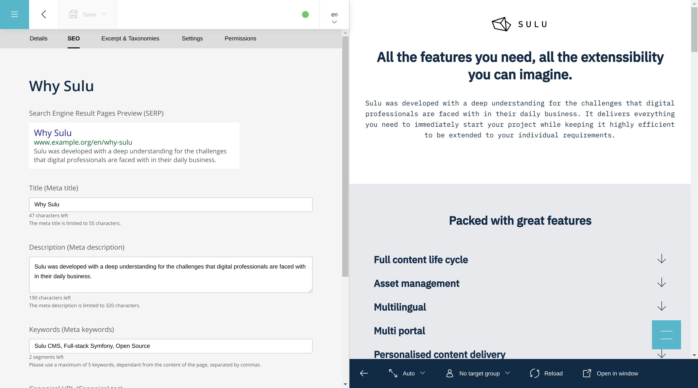
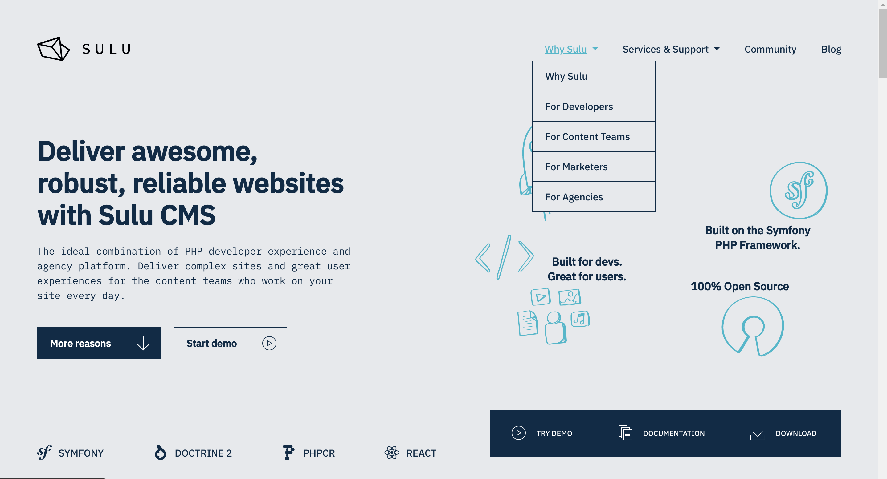

Rendering Pages with Twig
=========================

Twig is an awesome option for rendering HTML. It got some nice features like
blocks and inheritance. That's why we use and love Twig.

Which Twig-Template is used?
----------------------------

In :doc:`templates` we learned how to define a template.

.. code-block:: xml

    <?xml version="1.0" ?>
    <template xmlns="http://schemas.sulu.io/template/template"
            xmlns:xsi="http://www.w3.org/2001/XMLSchema-instance"
            xsi:schemaLocation="http://schemas.sulu.io/template/template http://schemas.sulu.io/template/template-1.0.xsd">

        <key>default</key>

        <view>templates/default</view>
        <controller>Sulu\Bundle\WebsiteBundle\Controller\DefaultController::indexAction</controller>
        ...
    </template>

In the page template the view could be set. Internally Sulu appends the format
of the request to find the correct template to render the response. As an
example sulu uses for a html request the template
`templates/pages/default.html.twig` or
`templates/pages/default.xml.twig` for a xml request. With this
feature you are able to define different output format for a single page.

Rendering the Content
---------------------

If you don't use your custom controller and modify the output the Sulu
Controller renders, Sulu passes some default variables to Twig.

Content
^^^^^^^

In the content everything you defined in your template is saved.
If you got a title you could easily obtain it from the content-var.

.. code-block:: html

    <h1>{{ content.title }}</h1>

Extension
^^^^^^^^^

In the extension var Sulu writes content from Sulu extensions. Typically stuff
that is defined in separate tabs in the Sulu content section.
At the moment there is the SEO and the excerpt extension, that could be used.
This extensions are available on every page no matter which template you chose.

Here is an example how it could look like in the backend. Notice the
"Excerpt & Categories" tab next to the SEO tab.

You could include the SEO meta tags like this:

.. code-block:: html

    

The excerpt data is available from:

.. code-block:: html

    {{ extension.excerpt.title }}
    {{ extension.excerpt.description }}
    {{ extension.excerpt.more }}
    {{ extension.excerpt.icon[0].thumbnails['50x50'] }}
    {{ extension.excerpt.images[0].thumbnails['300x300'] }}

View
^^^^

In the ``view`` variable Sulu writes the view data of the defined properties
in your template. As an example the ``media_selection`` stores the
``displayOption`` there.

.. code-block:: html

    {{ view.media.displayOption }}

Other Variables
^^^^^^^^^^^^^^^

 - `request.webspaceKey`: Contains the key for the current webspace
 - `request.webspaceName`: Contains the name for the current webspace
 - `request.portalKey`: Contains the key for the current portal
 - `request.portalName`: Contains the name for the current portal
 - `request.locale`: Contains the locale for the current request
 - `request.portalUrl`: Contains the root URL to the current portal
 - `request.resourceLocatorPrefix`: Contains the prefix for the current portal
 - `request.resourceLocator`: Contains the resourceLocator to the current page
 - `uuid`: Contains the uuid of the current page
 - `template`: Contains the template key of the current page
 - `creator`: Contains the id of the creator of the current page
 - `changer`: Contains the id of the changer of the current page
 - `created`: Contains the timestamp of the creation of the current page
 - `changed`: Contains the timestamp of the latest change of the current page
 - `published`: Contains the timestamp of the publishing of the current page
 - `urls`: Contains urls of all locales

.. tip::

    You can also use ``{{ dump() }}`` in the template to see all available variables if you are in dev mode.

Navigation
^^^^^^^^^^

There is a Twig function that obtains the menu. You need to pass the key of the
navigation context you defined in your webspace (:doc:`webspaces`).
While editing a page the navigation context could be defined in
*settings > Navigation context*. For many projects one or two navigation
contexts might be enough:

* The main navigation usually is the main entry point for the user of the
  website.
* A footer navigation can be useful for imprints and similar pages.

The following screenshot shows the `Sulu homepage`_ with the main navigation on
the top. As you can see the navigation returned for the navigation contexts are
not necessarily flat, but can also contain sub pages.

The navigation contexts can also be used in any other combination you want. The
separation into main and footer navigation is only a quite common example.

The advantage of this method is that the content manager can decide on his own
which pages to show in the navigation. This code show an example for creating a
nested navigation using all the pages marked to be shown in the main navigation
context.

.. code-block:: html

    <ul>
        
        <li>
            <a href="{{ sulu_content_path(item.url) }}"
                title="{{ item.title }}">{{ item.title }}</a>
            
                <ul>
                
                    <li><a href="{{ sulu_content_path(child.url) }}"
                            title="{{ child.title }}">
                        {{ child.title }}
                    </a></li>
                
                </ul>
            
        </li>
        
    </ul>

Images
^^^^^^

If there are images defined in your template you could render them by using
this code:

.. code-block:: html

    
    

        
        
{{ image.title }}

    

    

Image formats need to be defined in the `image_formats.xml`_ in your config.

CSS / JS
--------

You can organize and build your website assets the way you are most familiar with.
If you want to use Symfony's Webpack Encore, have a look at the :doc:`../cookbook/webpack-encore`.

.. _image_formats.xml: https://github.com/sulu/skeleton/blob/master/config/image-formats.xml
.. _Sulu Homepage: http://sulu.io
