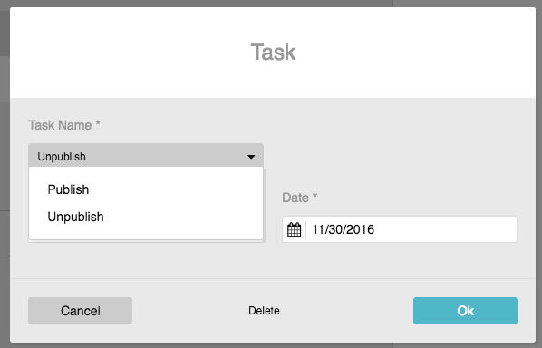

Custom Handler
==============

Custom handler provides functionality which can be scheduled with the
``automation-tab`` (see :doc:`tab`). The handler can implement custom-logic
which publishes or remove the entity on which is was created.

To use a handler in the automation tab it has to implement the interface
``AutomationTaskHandlerInterface`` which extends the ``TaskHandlerInterface``
from php-task.

.. code-block:: php

    <?php

    namespace AppBundle\Automation;

    use AppBundle\Entity\NewsItem;
    use Sulu\Bundle\AutomationBundle\TaskHandler\AutomationTaskHandlerInterface;
    use Sulu\Bundle\AutomationBundle\TaskHandler\TaskHandlerConfiguration;
    use Symfony\Component\OptionsResolver\OptionsResolver;

    class PublishHandler implements AutomationTaskHandlerInterface
    {
        /**
         * This function will be called inside the task:run command
         * when a scheduled task elapses.
         *
         * @param array $workload
         *
         * @return string|\Serializable as the result of this handler.
         */
        public function handle($workload)
        {
            $id = $workload['id'];
            $locale = $workload['locale'];

            // TODO implement custom logic
        }

        /**
         * The given OptionsResolver will be used to validate the workload
         * before scheduling the task.
         *
         * @param OptionsResolver $optionsResolver
         *
         * @return OptionsResolver
         */
        public function configureOptionsResolver(OptionsResolver $optionsResolver)
        {
            return $optionsResolver
                ->setRequired(['id', 'locale'])
                ->setAllowedTypes('id', 'string')
                ->setAllowedTypes('locale', 'string');
        }

        /**
         * Returns true if handler supports given class.
         *
         * @param string $entityClass
         *
         * @return bool
         */
        public function supports($entityClass)
        {
            return $entityClass === NewsItem::class
                || is_subclass_of($entityClass, NewsItem::class);
        }

        /**
         * Returns the configuration for this handler.
         *
         * @return TaskHandlerConfiguration
         */
        public function getConfiguration()
        {
            // The first parameter will be used as translation key in the
            // frontend
            return TaskHandlerConfiguration::create('app.publish');
        }
    }

.. code-block:: xml

    <service id="app.automation.publish_handler" class="AppBundle\Automation\PublishHandler">
        <tag name="task.handler"/>
    </service>

.. note::

    If you integrate this into a public bundle you should check the existence
    of the AutomationBundle in your extension and omit this definition if it
    is not registered.

This handler will now be selectable in the ``automation-tab`` of the NewsItem.

