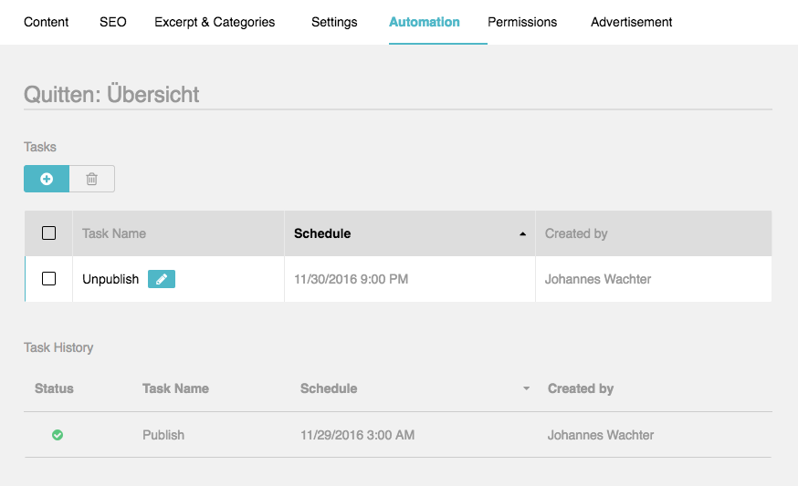

AutomationBundle
================

The AutomationBundle provides the functionality for managing automated tasks.
This tasks can be used for example to publish or unpublish pages at a
specific timestamp. This handlers (like publish) can be implemented by the
application or any bundle.

Basic Ideas
-----------

The basic idea behind this bundle was to enhance the content manager with the
possibility to plan when a page will be online. But also other tasks should
be possible. One of many scenarios could be to send a mail after 6 months to
check the content of the page

As basic implementation for task scheduling and running the
`PHP-Task Library`_ and the `Bundle`_  was used.

.. note::

    Outside the "automation" bundle the `PHP-Task Library`_ can be used for
    recurring or single-time tasks which are necessary for your application.
    For more information about the library and the bundle itself take a look
    at the `PHP-Task Documentation`_.

As recommended run-mode (beside the ``kernel.terminate`` Listener) you should
use the ``task:run`` command inside a cron-job. For the interval of
the cron-job you have to decide how precise the task shoud run at the
given timestamp. For example if you choose an interval of 1 hour the tasks
will only run each hour.

Installation
------------

All of the dependencies will be installed automatically with ``sulu/sulu``.
Because of this you only have to register the AutomationBundle and the
TaskBundle in your Kernel and ``app/config/admin/routing.yml`` file.

.. code-block:: php

    ...

    // php-task
    new Task\TaskBundle\TaskBundle(),

    // sulu
    new Sulu\Bundle\AutomationBundle\SuluAutomationBundle(),

    ...

.. code-block:: yaml

    sulu_automation_api:
        type: rest
        resource: "@SuluAutomationBundle/Resources/config/routing_api.xml"
        prefix: /admin/api

    sulu_automation:
        type: rest
        resource: "@SuluAutomationBundle/Resources/config/routing.xml"
        prefix: /admin/automation

For recommended run mode and other settings you should use the default
configuration.

Further Topics
--------------

.. toctree::
    :maxdepth: 1

    handler
    tab

.. _PHP-Task Library: https://github.com/php-task/php-task
.. _Bundle: https://github.com/php-task/TaskBundle
.. _PHP-Task Documentation: http://php-task.readthedocs.io/en/latest/
