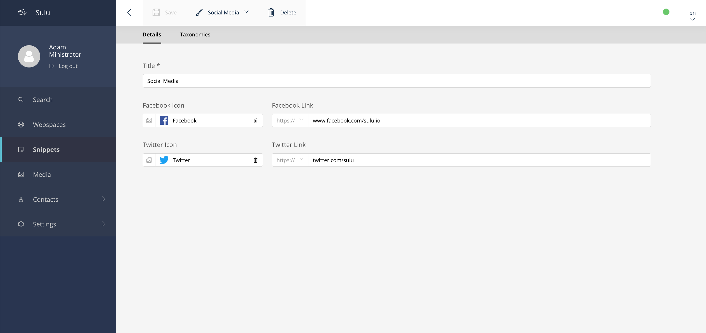
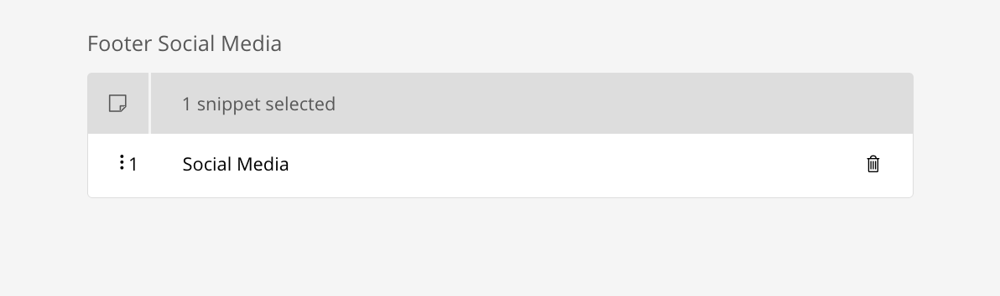

SnippetBundle
=============

The SnippetBundle contains the implementation to use snippets in Sulu.

What is a Snippet
-----------------

As the name suggests, a snippet is a small fragment on a page.
However, unlike blocks, for example, which would also fit this description, the idea with snippets is reusability.
As a section of a web page a snippet must be first universally maintained, and thereafter be reused anywhere on the website.
An example on a website would be a social media section.

In this section there would be logos of social services like Facebook and a link to the profile on the service.
This section could of course also be built conventionally in a page template, but you would have to maintain it on each page.

This is where snippets come into play.
A snippet could be configured to cover exactly this use case and you would only have to maintain the profiles once and could reuse them at any point.

Creating a Snippet Template
---------------------------

In this example we'll creating a "Social Media" snippet to the page of Sulu.

Creating a snippet Template isn't really different like Page :doc:`../book/templates`.
Create a XML File in your `config/templates/snippets/` folder like the following example

.. note::

    The <key> and the name of the XML must be the same!

.. code-block:: xml

    <?xml version="1.0" ?>
    <template xmlns="http://schemas.sulu.io/template/template"
              xmlns:xsi="http://www.w3.org/2001/XMLSchema-instance"
              xsi:schemaLocation="http://schemas.sulu.io/template/template http://schemas.sulu.io/template/template-1.0.xsd">

        <key>social_media</key>

        <meta>
            <title lang="en">Social Media</title>
            <title lang="de">Social Media</title>
        </meta>

        <properties>
            <property name="title" type="text_line" mandatory="true">
                <meta>
                    <title lang="en">Title</title>
                    <title lang="de">Titel</title>
                </meta>
                <tag name="sulu.node.name"/>
            </property>

            <property name="facebookImage" colspan="3" type="single_media_selection">
                <meta>
                    <title lang="en">Facebook Icon</title>
                    <title lang="de">Facebook Icon</title>
                </meta>
            </property>

            <property name="facebookLink" colspan="9" type="url">
                <meta>
                    <title lang="en">Facebook Link</title>
                    <title lang="de">Facebook Link</title>
                </meta>
                <params>
                    <param name="schemes" type="collection">
                        <param name="http://"/>
                        <param name="https://"/>
                    </param>
                </params>
            </property>

            <property name="twitterImage" colspan="3" type="single_media_selection">
                <meta>
                    <title lang="en">Twitter Icon</title>
                    <title lang="de">Twitter Icon</title>
                </meta>
            </property>

            <property name="twitterLink" colspan="9" type="url">
                <meta>
                    <title lang="en">Twitter Link</title>
                    <title lang="de">Twitter Link</title>
                </meta>
                <params>
                    <param name="schemes" type="collection">
                        <param name="http://"/>
                        <param name="https://"/>
                    </param>
                </params>
            </property>
        </properties>
    </template>

Properties
----------

Properties are the same as Page :doc:`../book/templates`.

Implement a Snippet in your Template
------------------------------------

Snippets are stored separately and are not accessible via the web page URL.

So if we want to use a snippet on a page, we need to add the property type ":doc:`../reference/property-types/single_snippet_selection`" if we want to link one or ":doc:`../reference/property-types/snippet_selection`" for more snippets.

.. code-block:: xml

        <property name="footer_social_media" type="snippet_selection">
            <meta>
                <title lang="en">Footer Social Media</title>
            </meta>
            <params>
                <param name="default" value="social_media"/>
            </params>
        </property>

Load Snippets from a Subfolder
------------------------------
By the means of configuration in `config/packages/sulu_admin.yaml` according to the following scheme
it is also possible to load snippet templates from custom folders.

.. code-block:: yaml

    sulu_admin:
        templates:
            snippet:
                default_type: 'my_snippet_key'
                directories:
                    event_snippets: "%kernel.project_dir%/config/templates/events/snippets/"

In this example, a new Events folder has been specified. It is important that the key for the configuration remains unique for each config.

Shadow Locales
--------------

Like pages and articles, a snippet can shadow another locale. A shadow locale shows the content of its source locale,
so content that is identical in several locales has to be maintained only once.

To use it, open the snippet in the locale that should become the shadow, go to the *Settings* tab, enable *Shadow*
and choose the source locale. The toggle is disabled while the current locale is itself the source of another shadow.

* Saving the settings gives the new shadow the template and content of its source locale.
* The source locale has to be published before the shadow can be published, otherwise publishing fails with a hint to
  publish the source first.
* Publishing the shadow copies the live content of the source locale into the live content of the shadow. Publishing the
  source again refreshes all its shadows.
* A shadow stores no references of its own.

Rendering does not change. For a shadow locale, :doc:`../reference/twig-extensions/functions/sulu_snippet_load_by_area`
returns the content of the source locale:

.. code-block:: twig

    {{ sulu_snippet_load_by_area('hotel') }}

.. note::

    The shadow locales are stored in the ``shadowLocale`` and ``shadowLocales`` columns of the
    ``sn_snippet_dimension_contents`` table, run ``bin/console doctrine:migrations:migrate`` after updating. A project
    with its own implementation of ``SnippetDimensionContentInterface`` has to implement the methods of
    ``Sulu\Content\Domain\Model\ShadowInterface``, most simply by using ``Sulu\Content\Domain\Model\ShadowTrait``.

Learn more
----------

* :doc:`../cookbook/default-snippets`
* Property type reference for :doc:`../reference/property-types/single_snippet_selection`
* Property type reference for :doc:`../reference/property-types/snippet_selection`
