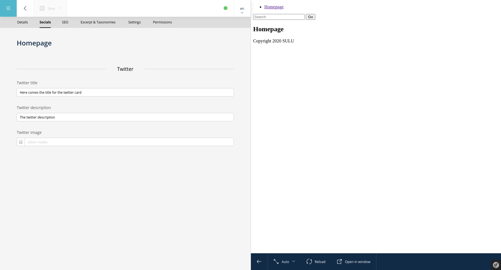

Adding tabs to Sulu's Admin UI
==============================

.. note::

    It is recommended to read :doc:`../book/extend-admin` beforehand to get a better understandig of how Sulu admin
    classes work.

This tutorial will walk you through the process of adding an extra tab to the administration interface.

This could be useful in many different situations, like e.g. adding an extra tab for social media information to pages
or contacts.

In this example we'll be adding a "Socials" tab to the page form of Sulu.

Create the form for this view
-----------------------------

You have to create the form that is rendered in this view. Therefore create a form at
``config/forms/page_socials.xml``.

.. note::

    Note how we use slashes in the names of the properties, this returns the values in the given hierarchy.

.. code-block:: xml

    <?xml version="1.0" ?>
    <form xmlns="http://schemas.sulu.io/template/template"
        xmlns:xsi="http://www.w3.org/2001/XMLSchema-instance"
        xsi:schemaLocation="http://schemas.sulu.io/template/template http://schemas.sulu.io/template/form-1.0.xsd"
    >
        <key>page_socials</key>

        <properties>
            <section name="twitter">
                <meta>
                    <title lang="en">Twitter</title>
                </meta>
                <properties>
                    <property name="ext/social/twitter_title" type="text_line">
                        <meta>
                            <title lang="en">Twitter title</title>
                        </meta>
                    </property>
                    <property name="ext/social/twitter_description" type="text_line">
                        <meta>
                            <title lang="en">Twitter description</title>
                        </meta>
                    </property>
                    <property name="ext/social/twitter_image" type="single_media_selection">
                        <meta>
                            <title lang="en">Twitter image</title>
                        </meta>
                        <params>
                            <param name="types" value="image"/>
                            <param name="formats" type="collection">
                                <param name="og_image" />
                            </param>
                        </params>
                    </property>
                </properties>
            </section>
        </properties>
    </form>

Register the view in your admin class
-------------------------------------

We'll create a class ``src/Admin/SocialAdmin`` which extends ``Sulu\Bundle\AdminBundle\Admin``.

In the ``Admin`` we need to implement ``configureViews``. For our example we need the ``webspace_manager`` in
combination with ``security_checker`` to check if the logged in user has permission to edit pages.

Note the ``setParent`` call adding the view as a child to ``PageAdmin::EDIT_FORM_VIEW``. This will result in a new tab
in the edit form for pages.

The ``setFormKey`` takes a string reference, which should be the same as the key tag in the above form XML.

.. code-block:: php

    class SocialAdmin extends Admin
    {
        public function __construct(
            private ViewBuilderFactoryInterface $viewBuilderFactory,
            private WebspaceManagerInterface $webspaceManager,
            private SecurityCheckerInterface $securityChecker
        ) {
        }

        public function configureViews(ViewCollection $viewCollection): void
        {
            $formToolbarActionsWithoutType = [
                new ToolbarAction('sulu_admin.save_with_publishing'),
            ];

            $routerAttributesToFormRequest = ['parentId', 'webspace'];
            $routerAttributesToFormMetdata = ['webspace'];

            $previewCondition = 'nodeType == 1';

            if ($this->hasSomeWebspacePermission()) {
                $viewCollection->add(
                    $this->viewBuilderFactory
                        ->createPreviewFormViewBuilder('sulu_page.page_edit_form.socials', '/socials')
                        ->disablePreviewWebspaceChooser()
                        ->setResourceKey('pages')
                        ->setFormKey('page_socials')
                        ->setTabTitle('Socials')
                        ->setTabPriority(256)
                        ->addToolbarActions($formToolbarActionsWithoutType)
                        ->addRouterAttributesToFormRequest($routerAttributesToFormRequest)
                        ->setPreviewCondition($previewCondition)
                        ->setTitleVisible(true)
                        ->setTabOrder(1536)
                        ->setParent(PageAdmin::EDIT_FORM_VIEW)
                );
            }
        }

        private function hasSomeWebspacePermission(): bool
        {
            foreach ($this->webspaceManager->getWebspaceCollection()->getWebspaces() as $webspace) {
                $hasWebspacePermission = $this->securityChecker->hasPermission(
                    PageAdmin::SECURITY_CONTEXT_PREFIX . $webspace->getKey(),
                    PermissionTypes::EDIT
                );

                if ($hasWebspacePermission) {
                    return true;
                }
            }

            return false;
        }
    }

We can register this class as a service and give it a ``sulu.admin`` tag, then it will be picked up by Sulu.

.. code-block:: yaml

    app.social_admin:
        class: App\Admin\SocialAdmin
        arguments:
            - '@Sulu\Bundle\AdminBundle\Admin\View\ViewBuilderFactoryInterface'
            - '@sulu_core.webspace.webspace_manager'
            - '@sulu_security.security_checker'
        tags:
            - { name: 'sulu.admin'}
            - { name: 'sulu.context', context: 'admin' }

When you debug the container right now your should see your own ``Admin`` class show up.

.. code-block:: bash

    $ php bin/console debug:container --tag=sulu.admin

        Service ID               Class name
        sulu_contact.admin       Sulu\Bundle\ContactBundle\Admin\ContactAdmin
        sulu_preview.admin       Sulu\Bundle\PreviewBundle\Admin\PreviewAdmin
        sulu_custom_urls.admin   Sulu\Bundle\CustomUrlBundle\Admin\CustomUrlAdmin
        sulu_website.admin       Sulu\Bundle\WebsiteBundle\Admin\WebsiteAdmin
        sulu_tag.admin           Sulu\Bundle\TagBundle\Admin\TagAdmin
        sulu_page.admin          Sulu\Bundle\PageBundle\Admin\PageAdmin
        sulu_snippet.admin       Sulu\Bundle\SnippetBundle\Admin\SnippetAdmin
        sulu_category.admin      Sulu\Bundle\CategoryBundle\Admin\CategoryAdmin
        sulu_security.admin      Sulu\Bundle\SecurityBundle\Admin\SecurityAdmin
        sulu_media.admin         Sulu\Bundle\MediaBundle\Admin\MediaAdmin
        sulu_search.admin        Sulu\Bundle\SearchBundle\Admin\SearchAdmin
        app.social_admin         App\Admin\SocialAdmin

You should now see the tab in the administration interface, but the data of the form is not saved yet.

Persist the data of the form
----------------------------

In the final step, we need to persist the data of the added tab. In the case of the pages, we can utilize the existing
pages API by registering a new `StructureExtension`. In other cases, we would need to implement our own API endpoint
for the tab as shown in the :doc:`../book/extend-admin` chapter.

.. code-block :: php

    <?php

    class SocialStructureExtension extends AbstractExtension implements ExportExtensionInterface
    {
        /**
        * name of structure extension.
        */
        const SOCIAL_EXTENSION_NAME = 'social';

        protected $properties = [
            'twitter_title',
            'twitter_description',
            'twitter_image',
        ];

        protected $name = self::SOCIAL_EXTENSION_NAME;

        protected $additionalPrefix = 'social';

        public function save(NodeInterface $node, $data, $webspaceKey, $languageCode)
        {
            $this->setLanguageCode($languageCode, 'i18n', null);

            $data = $this->encodeImages($data);

            $this->saveProperty($node, $data, 'twitter_title');
            $this->saveProperty($node, $data, 'twitter_description');
            $this->saveProperty($node, $data, 'twitter_image');
        }

        public function load(NodeInterface $node, $webspaceKey, $languageCode)
        {
            $twitterImageNode = $this->loadProperty($node, 'twitter_image');
            $twitterImage = null;
            if ($twitterImageNode) {
                $twitterImage = json_decode($twitterImageNode, true);
            }

            return [
                'twitter_title' => $this->loadProperty($node, 'twitter_title'),
                'twitter_description' => $this->loadProperty($node, 'twitter_description'),
                'twitter_image' => $twitterImage,
            ];
        }

        public function export($properties, $format = null)
        {
            $data = [];
            foreach ($properties as $key => $property) {
                $value = $property;
                if (\is_bool($value)) {
                    $value = (int) $value;
                }

                $data[$key] = [
                    'name' => $key,
                    'value' => $value,
                    'type' => '',
                ];
            }

            return $data;
        }

        public function import(NodeInterface $node, $data, $webspaceKey, $languageCode, $format)
        {
            $this->setLanguageCode($languageCode, 'i18n', null);

            $this->save($node, $data, $webspaceKey, $languageCode);
        }

        public function getImportPropertyNames()
        {
            return $this->properties;
        }

        private function encodeImages(array $data)
        {
            if ($data['twitter_image']) {
                $data['twitter_image'] = json_encode($data['twitter_image']);
            }

            return $data;
        }
    }

This class needs to be registered as a service with the tag ``sulu.structure.extension``.

.. code-block :: yaml

    app.social_structure_extension:
        class: App\Structure\SocialStructureExtension
        tags: { name: 'sulu.structure.extension' }
