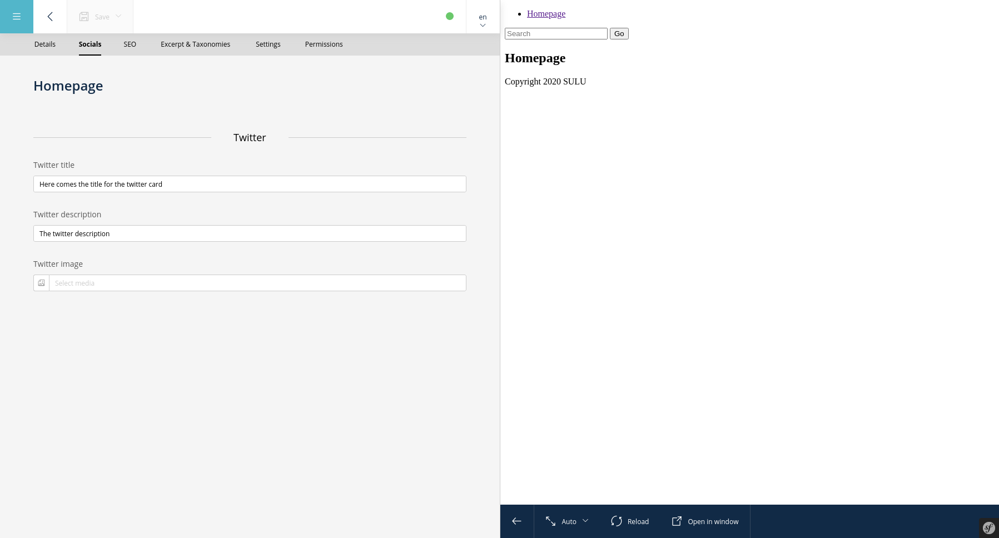

Adding tabs to Sulu's Admin UI
==============================

.. note::

    It is recommended to read :doc:`../book/extend-admin` beforehand to get a better understandig of how Sulu admin
    classes work.

This tutorial will walk you through the process of adding an extra tab to the administration interface.

This could be useful in many different situations, like e.g. adding an extra tab for social media information to pages
or contacts.

In this example we'll be adding a "Socials" tab to the page form of Sulu.

Create the form for this view
-----------------------------

You have to create the form that is rendered in this view. Therefore create a form at
``config/forms/page_socials.xml``.

.. note::

    Note how we use slashes in the names of the properties, this returns the values in the given hierarchy.

.. code-block:: xml

    <?xml version="1.0" ?>
    <form xmlns="http://schemas.sulu.io/template/template"
        xmlns:xsi="http://www.w3.org/2001/XMLSchema-instance"
        xsi:schemaLocation="http://schemas.sulu.io/template/template http://schemas.sulu.io/template/form-1.0.xsd"
    >
        <key>page_socials</key>

        <properties>
            <section name="twitter">
                <meta>
                    <title lang="en">Twitter</title>
                </meta>
                <properties>
                    <property name="ext/social/twitter_title" type="text_line">
                        <meta>
                            <title lang="en">Twitter title</title>
                        </meta>
                    </property>
                    <property name="ext/social/twitter_description" type="text_line">
                        <meta>
                            <title lang="en">Twitter description</title>
                        </meta>
                    </property>
                    <property name="ext/social/twitter_image" type="single_media_selection">
                        <meta>
                            <title lang="en">Twitter image</title>
                        </meta>
                        <params>
                            <param name="types" value="image"/>
                            <param name="formats" type="collection">
                                <param name="og_image" />
                            </param>
                        </params>
                    </property>
                </properties>
            </section>
        </properties>
    </form>

Register the view in your admin class
-------------------------------------

We'll create a class ``src/Admin/SocialAdmin`` which extends ``Sulu\Bundle\AdminBundle\Admin``.

In the ``Admin`` we need to implement ``configureViews``. For our example we need the ``webspace_manager`` in
combination with ``security_checker`` to check if the logged in user has permission to edit pages.

Note the ``setParent`` call adding the view as a child to ``PageAdmin::EDIT_FORM_VIEW``. This will result in a new tab
in the edit form for pages.

The ``setFormKey`` takes a string reference, which should be the same as the key tag in the above form XML.

.. code-block:: php

    class SocialAdmin extends Admin
    {
        public function __construct(
            private ViewBuilderFactoryInterface $viewBuilderFactory,
            private WebspaceManagerInterface $webspaceManager,
            private SecurityCheckerInterface $securityChecker
        ) {
        }

        public function configureViews(ViewCollection $viewCollection): void
        {
            $formToolbarActionsWithoutType = [
                new ToolbarAction('sulu_admin.save_with_publishing'),
            ];

            $routerAttributesToFormRequest = ['parentId', 'webspace'];
            $routerAttributesToFormMetdata = ['webspace'];

            $previewCondition = 'nodeType == 1';

            if ($this->hasSomeWebspacePermission()) {
                $viewCollection->add(
                    $this->viewBuilderFactory
                        ->createPreviewFormViewBuilder('sulu_page.page_edit_form.socials', '/socials')
                        ->disablePreviewWebspaceChooser()
                        ->setResourceKey('pages')
                        ->setFormKey('page_socials')
                        ->setTabTitle('Socials')
                        ->setTabPriority(256)
                        ->addToolbarActions($formToolbarActionsWithoutType)
                        ->addRouterAttributesToFormRequest($routerAttributesToFormRequest)
                        ->setPreviewCondition($previewCondition)
                        ->setTitleVisible(true)
                        ->setTabOrder(1536)
                        ->setParent(PageAdmin::EDIT_FORM_VIEW)
                );
            }
        }

        private function hasSomeWebspacePermission(): bool
        {
            foreach ($this->webspaceManager->getWebspaceCollection()->getWebspaces() as $webspace) {
                $hasWebspacePermission = $this->securityChecker->hasPermission(
                    PageAdmin::SECURITY_CONTEXT_PREFIX . $webspace->getKey(),
                    PermissionTypes::EDIT
                );

                if ($hasWebspacePermission) {
                    return true;
                }
            }

            return false;
        }
    }

We can register this class as a service and give it a ``sulu.admin`` tag, then it will be picked up by Sulu.

.. code-block:: yaml

    app.social_admin:
        class: App\Admin\SocialAdmin
        arguments:
            - '@Sulu\Bundle\AdminBundle\Admin\View\ViewBuilderFactoryInterface'
            - '@sulu_core.webspace.webspace_manager'
            - '@sulu_security.security_checker'
        tags:
            - { name: 'sulu.admin'}
            - { name: 'sulu.context', context: 'admin' }

When you debug the container right now your should see your own ``Admin`` class show up.

.. code-block:: bash

    $ php bin/console debug:container --tag=sulu.admin

        Service ID               Class name
        ...
        app.social_admin         App\Admin\SocialAdmin

You should now see the tab in the administration interface, but the data of the form is not saved yet.

Persist the data of the form
----------------------------

Extend the PageDimensionContent entity.

.. code-block:: yaml

    # config/packages/sulu_page.yaml
    sulu_page:
        objects:
            page:
                model: App\Entity\Page
            page_content:
                model: App\Entity\PageDimensionContent

See :doc:`../book/extend-entities` for more information about extending entities in Sulu entities.

.. note::

    This documentation does not yet exist for Sulu 3.0. Please feel free to contribute it.

    Next Step would be to create a ContentMerger, ContentDataMapper and ContentNormalizer for our new data.
    Currently these steps are not yet documented but look at AuthorMerger, AuthorDataMapper and AuthorNormalizer classes as reference:

     - ``PageSocialMerger`` implements ``Sulu\Content\Application\ContentMerger\Merger\MergerInterface``
     - ``PageSocialDataMapper`` implements ``Sulu\Content\Application\ContentDataMapper\DataMapper\DataMapperInterface``
     - ``PageSocialNormalizer`` implements ``Sulu\Content\Application\ContentNormalizer\Normalizer\NormalizerInterface``
