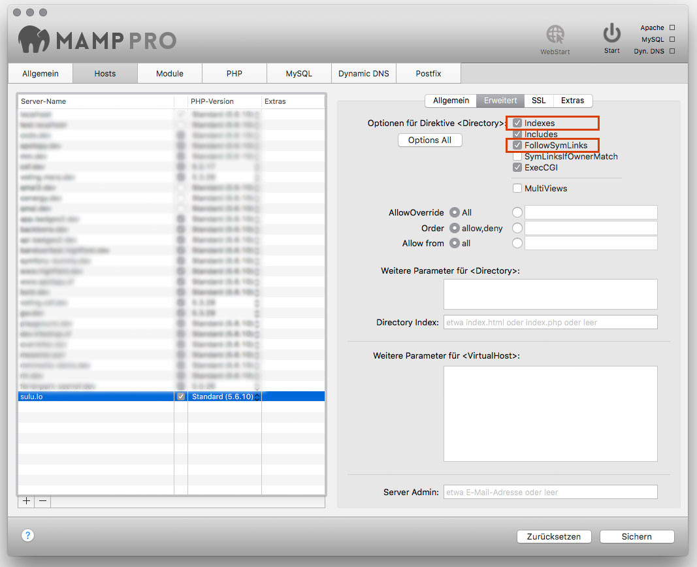

Apache
======

The Apache HTTP Server is the world's most used web server (according to
Wikipedia). It is open source, mature and reliable.

To serve a Sulu website with Apache, you need to adapt your `hosts` file, create
a virtual host configuration file and restart your server.

Host Name Configuration
-----------------------

Add the domain of your site to the `hosts` file. Depending on your operating
system, this file can be found in different places:

* Unix: ``/etc/hosts``
* Windows: ``%SystemRoot%\System32\drivers\etc\hosts``

On a development machine, we could use the domain `sulu.lo` ("lo" stands for
"local"). Add that domain to the end of the `hosts` file:

.. code-block:: text

    # ...

    127.0.0.1  sulu.lo

When you type the URL http://sulu.lo in your browser, the browser will now
load the page from your computer.

.. note::

    You may need to restart your browser after changing the `hosts` file.

But before it works, we need to tell Apache what to do when that URL is loaded.

Virtual Host Configuration
--------------------------

Let's add the Apache configuration file for the `sulu.lo` domain.

.. code-block:: apache

  <VirtualHost *:80>
      DocumentRoot "/var/www/sulu.lo/web"
      ServerName sulu.lo
      <Directory "/var/www/sulu.lo/web">
          Options Indexes FollowSymLinks
          AllowOverride All
          Require all granted
          # For Apache 2.2 instead of 'Require all granted' the following is needed:
          # Order allow,deny
          # Allow from all

          SetEnv SYMFONY_ENV dev

          <IfModule mod_expires.c>
              ExpiresActive On
              ExpiresByType image/gif "access plus 1 month"
              ExpiresByType image/png "access plus 1 month"
              ExpiresByType image/svg+xml "access plus 1 month"
              ExpiresByType image/svg "access plus 1 month"
              ExpiresByType image/jpeg "access plus 1 month"
              ExpiresByType image/jpg "access plus 1 month"
              ExpiresByType image/webp "access plus 1 month"
              ExpiresByType image/x-icon "access plus 1 month"
              ExpiresByType image/vnd.microsoft.icon "access plus 1 month"
              ExpiresByType text/javascript "access plus 1 month"
              ExpiresByType text/css "access plus 1 month"
              ExpiresByType font/woff2 "access plus 1 month"
              ExpiresByType font/woff "access plus 1 month"
              ExpiresByType font/eot "access plus 1 month"
              ExpiresByType font/ttf "access plus 1 month"
              ExpiresByType video/mp4 "access plus 1 month"
          </IfModule>

          <IfModule mod_deflate.c>
              SetOutputFilter DEFLATE
              SetEnvIfNoCase Request_URI \.(?:gif|jpe?g|png|webp|mp4)$ no-gzip dont-vary
              SetEnvIfNoCase Request_URI \.(?:exe|t?gz|zip|bz2|sit|rar)$ no-gzip dont-vary
              SetEnvIfNoCase Request_URI \.pdf$ no-gzip dont-vary

              BrowserMatch ^Mozilla/4 gzip-only-text/html
              BrowserMatch ^Mozilla/4\.0[678] no-gzip
              BrowserMatch \bMSIE !no-gzip !gzip-only-text/html
          </IfModule>
      </Directory>
  </VirtualHost>

.. note::
    It is a good practice to create a virtual host for each of your Sulu projects.
    They are separated by domain and you'll got full control on what you expose.

MAMP Pro
--------

In general you should configure your vHost like the `Apache`_ paragraph above describes it.

If you want to enable the dev-environment (*including the debug toolbar*) you have to be sure that the
vHost environment variable (``SetEnv SYMFONY_ENV dev``) is set properly
and you configured a DEV-domain within your  `webspace.xml <setup.rst#webspaces>`_.

.. include:: file-permissions.inc.rst

