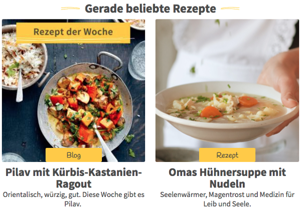
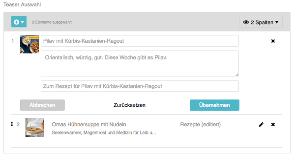
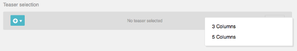

Teaser Selection
================

The "teaser_selection" content type is used for displaying teasers to other
content in your website. These teasers could be arranged as list or grid, like
in this example:

In the administration interface, the widget is displayed as a selector for the
teasers. Content managers can choose a number of target contents. By default,
the text from the "Excerpt & Categories" tab of the target content is shown.
You can however customize the text of the teaser if you like.

Configuration
-------------

Add a field of type "teaser_selection" to your page template:

.. code-block:: xml

    <!-- app/Resources/templates/pages/overview.xml -->
    <?xml version="1.0" ?>
    <template xmlns="http://schemas.sulu.io/template/template"
              xmlns:xsi="http://www.w3.org/2001/XMLSchema-instance"
              xmlns:xi="http://www.w3.org/2001/XInclude"
              xsi:schemaLocation="http://schemas.sulu.io/template/template http://schemas.sulu.io/template/template-1.1.xsd">

        <!-- ... -->

        <properties>
            <!-- ... -->

            <property name="teasers" type="teaser_selection">
                <meta>
                    <title lang="en">Teasers</title>
                </meta>
            </property>

            <!-- ... -->
        </properties>
    </template>

Rendering
---------

In Twig, the field contains an array of teasers. Iterate the array and format
the teasers as you like:

.. code-block:: html+jinja

    <ul property="teasers">
        
            <li><a href="{{ sulu_content_path(teaser.url) }}">{{ teaser.title }}</a></li>
        
    </ul>

Each teaser is an object with the following properties:

.. list-table::
    :header-rows: 1

    * - Property
      - Type
      - Description
    * - id
      - string
      - The ID of the teaser
    * - type (e.g. content or article)
      - string
      - The type of the teaser
    * - locale
      - string
      - The locale, e.g. "de_AT"
    * - title
      - string
      - The title of the teaser. This is usually taken from the "Excerpt
        & Categories" tab of the target content, but can be changed for each
        teaser
    * - description
      - string
      - The description of the teaser. This is usually taken from the "Excerpt
        & Categories" tab of the referenced content, but can be changed for
        each teaser
    * - moreText
      - string
      - The text of the "More" link
    * - mediaId
      - string
      - The ID of the image displayed with the teaser. Defaults to the first
        image in the tab "Excerpt & Categories", but can be changed for each
        teaser
    * - url
      - string
      - The relative URL of the target content

Parameters
----------

The following parameters can be used to customize the field in the page template:

.. list-table::
    :header-rows: 1

    * - Parameter
      - Type
      - Description
    * - present_as
      - collection
      - A collection of strings. Each string is typically a CSS class that is
        used to render the teaser list. You can configure the ``<title>`` of
        each entry that is shown in the admin

Configurable Presentation
-------------------------

Sometimes, a content manager wants to control exactly how a list of teasers
is presented. You can plan for different rendering variants in your design and
let the content manager choose one variant in the administration interface.

Use the ``present_as`` option to configure the rendering variants:

.. code-block:: xml

    <!-- app/Resources/templates/pages/overview.xml -->
    <?xml version="1.0" ?>
    <template xmlns="http://schemas.sulu.io/template/template"
              xmlns:xsi="http://www.w3.org/2001/XMLSchema-instance"
              xmlns:xi="http://www.w3.org/2001/XInclude"
              xsi:schemaLocation="http://schemas.sulu.io/template/template http://schemas.sulu.io/template/template-1.1.xsd">

        <!-- ... -->

        <properties>
            <!-- ... -->

            <property name="teasers" type="teaser_selection">
                <meta>
                    <title lang="en">Teasers</title>
                </meta>

                <params>
                    <param name="present_as" type="collection">
                        <param name="three-columns">
                            <meta>
                                <title lang="en">3 Columns</title>
                            </meta>
                        </param>
                        <param name="five-columns">
                            <meta>
                                <title lang="en">5 Columns</title>
                            </meta>
                        </param>
                    </param>
                </params>
            </property>

            <!-- ... -->
        </properties>
    </template>

The content manager can choose one of these variants in the administration
interface:

The selected value can be used to set the CSS class of the teaser element in Twig:

.. code-block:: html+jinja

    <ul property="teasers" class="{{ view.teasers.presentAs|default('') }}">
        
            <li><a href="{{ sulu_content_path(teaser.url) }}">{{ teaser.title }}</a></li>
        
    </ul>

Custom Content with Teaser Providers
------------------------------------

If you want to display teasers of custom data, create an implementation of
``TeaserProviderInterface``. For example, we'll make it possible to select
from a list of recipes:

.. code-block:: php

    <?php

    namespace AppBundle\Teaser;

    use Sulu\Bundle\ContentBundle\Teaser\Configuration\TeaserConfiguration;
    use Sulu\Bundle\ContentBundle\Teaser\Provider\TeaserProviderInterface;
    use Sulu\Bundle\ContentBundle\Teaser\Teaser;

    class RecipeTeaserProvider implements TeaserProviderInterface
    {
        /**
         * Returns the configuration for rendering the teaser provider in the
         * administration interface
         *
         * @return TeaserProvider
         */
        public function getConfiguration()
        {
            return new TeaserConfiguration(
                // The title in the dropdown of the administration interface
                'Recipe',
                // The JavaScript component started for selecting the content
                // In this case, we use the generic list component
                'teaser-selection/list@sulucontent',
                [                                 // Options of the JavaScript component
                    'url' => '/admin/api/recipe', // The API URL
                    'resultKey' => 'recipes',     // The key in the JSON returned by the API
                    'searchFields' => ['title'],  // The fields passed to the API when filtering for content
                    'matchings' => [              // The columns shown in the list
                        [
                            'content' => 'Title', // The column title
                            'name' => 'title',    // The field shown in the column
                        ],
                        [
                            'content' => 'Rating',
                            'name' => 'rating',
                        ],
                    ],
                ]
            );
        }

        /**
         * Returns the actual teaser data.
         *
         * @return Teaser[] The teasers
         */
        public function find(array $ids, $locale)
        {
            if (0 === count($ids)) {
                return [];
            }

            $items = ...; // load items by id

            foreach ($items as $item) {
                $result[] = new Teaser(...);
            }

            return $result;
        }
    }

Register the provider in Symfony's service container and tag it with
``sulu.teaser.provider`` to make it functional:

.. code-block:: xml

    <service id="recipe_teaser_provider" class="AppBundle\Teaser\RecipeTeaserProvider">
        <tag name="sulu.teaser.provider" alias="{your teaser-type}"/>
    </service>

Custom JavaScript Components
----------------------------

A teaser selection component is an AuraJS component that provides functionality
to select and deselect items.

The following is a simple (and incomplete) example. If you want to see a full
example, take a look at the components ``teaser-selection/content@sulucontent``
and ``teaser-selection/list@sulucontent``.

.. code-block:: javascript

    define(function() {

        'use strict';

        return {
            initialize: function() {
                var $container = $('
');
                this.$el.append($container);

                this.sandbox.start(
                    [
                        {
                            name: 'column-navigation@husky',
                            options: {
                                el: $container,
                                url: ..., // your api url
                                instanceName: this.options.instanceName,
                                actionIcon: 'fa-plus-circle',
                                resultKey: ..., // your api result-key
                                showOptions: false,
                                responsive: false,
                                markable: true,
                                sortable: false,
                                premarkedIds: _.map(this.options.data, function(item) {
                                    return item.id;
                                }),
                                actionCallback: function(item) {
                                    this.options.selectCallback({type: '...', id: item.id}); // your teaser-type
                                }.bind(this)
                            }
                        }
                    ]
                );
            }
        };
    });

