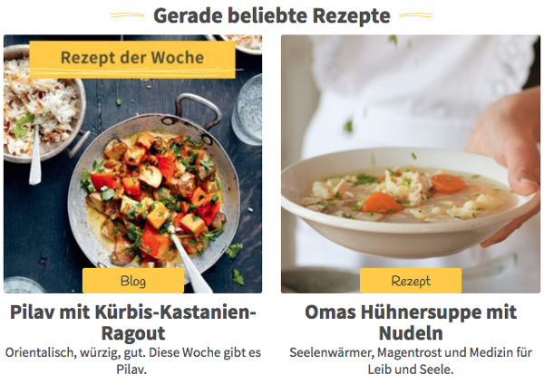
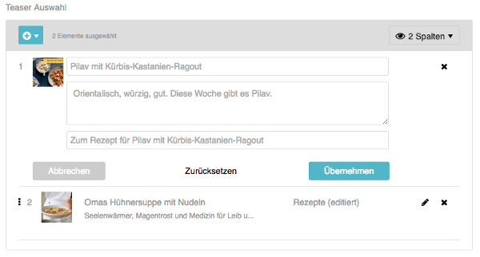
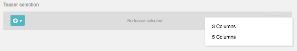

Teaser Selection
================

The "teaser_selection" property type is used for displaying teasers to other
content in your website. These teasers could be arranged as a list or grid, like
in this example:

In the administration interface, the widget is displayed as a selector for the
teasers. Content managers can choose a number of target contents. By default,
the text from the "Excerpt & Categories" tab of the target content is shown.
You can however customize the text of the teaser if you like.

Configuration
-------------

Add a field of type "teaser_selection" to your page template:

.. code-block:: xml

    <!-- config/templates/pages/overview.xml -->
    <?xml version="1.0" ?>
    <template xmlns="http://schemas.sulu.io/template/template"
              xmlns:xsi="http://www.w3.org/2001/XMLSchema-instance"
              xmlns:xi="http://www.w3.org/2001/XInclude"
              xsi:schemaLocation="http://schemas.sulu.io/template/template http://schemas.sulu.io/template/template-1.0.xsd">

        <!-- ... -->

        <properties>
            <!-- ... -->

            <property name="teasers" type="teaser_selection">
                <meta>
                    <title lang="en">Teasers</title>
                </meta>
            </property>

            <!-- ... -->
        </properties>
    </template>

Twig
----

In Twig, the field contains an array of teasers. Iterate the array and format
the teasers as you like:

.. code-block:: twig

    

        
            <article>
                <h3>{{ teaser.title }}</h3>

                
                    
                    
                        
                    
                

                
                    

                        {{ teaser.description|raw }}
                    

                

                <a href="{{ sulu_content_path(teaser.url) }}">
                    {{ teaser.moreText|default('Read more') }}
                </a>
            </article>
        
    

.. note::

    Some teaser providers include additional data in the ``attributes`` property.
    For example, article teasers may include the webspace information. You can
    access these with ``teaser.attributes.webspace``.

Each teaser is an object with the following properties:

.. list-table::
    :header-rows: 1
    :widths: 20 20 60

    * - Property
      - Type
      - Description
    * - id
      - int|string
      - The ID of the teaser
    * - type
      - string
      - The resource key/type of the teaser (e.g., "pages", "articles")
    * - locale
      - string
      - The locale of the teaser (e.g., "en", "de_AT")
    * - title
      - string
      - The title of the teaser. For pages and articles, this is taken from the
        "Excerpt & Categories" tab or the content title, but can be customized
        per teaser
    * - description
      - string
      - The description text. For pages and articles, this defaults to the
        excerpt description or tagged properties, but can be customized per teaser
    * - moreText
      - string
      - The text for the "read more" link. Defaults to excerpt more text
    * - mediaId
      - int|null
      - The ID of the teaser image. For pages and articles, defaults to the
        excerpt image or tagged media properties, but can be customized per teaser
    * - url
      - string
      - The URL of the target content
    * - attributes
      - array
      - Additional custom attributes provided by the teaser provider

Parameters
----------

The following parameters can be used to customize the field in the template:

.. list-table::
    :header-rows: 1
    :widths: 20 20 60

    * - Parameter
      - Type
      - Description
    * - present_as
      - collection
      - A collection of strings. Each string is typically a CSS class that is
        used to render the teaser list. You can configure the ``<title>`` of
        each entry that is shown in the admin
    * - min
      - string
      - The minimum number of selected teasers
    * - max
      - string
      - The maximum number of selected teasers

Tagging Properties for Teaser Data
-----------------------------------

You can tag properties in your template to use them as default teaser data:

**sulu.teaser.description**
    Use a text property as the default teaser description.

**sulu.teaser.media**
    Use a media property as the default teaser image.

Sulu resolves teaser data in this order: custom values → tagged properties →
excerpt data → content title.

.. code-block:: xml

    <property name="lead" type="text_editor">
        <meta>
            <title lang="en">Lead Text</title>
        </meta>
        <tag name="sulu.teaser.description"/>
    </property>

    <property name="header_image" type="single_media_selection">
        <meta>
            <title lang="en">Header Image</title>
        </meta>
        <tag name="sulu.teaser.media"/>
    </property>

Configurable Presentation
-------------------------

Sometimes, a content manager wants to control exactly how a list of teasers
is presented. You can plan for different rendering variants in your design and
let the content manager choose one variant in the administration interface.

Use the ``present_as`` option to configure the rendering variants:

.. code-block:: xml

    <!-- config/templates/pages/overview.xml -->
    <?xml version="1.0" ?>
    <template xmlns="http://schemas.sulu.io/template/template"
              xmlns:xsi="http://www.w3.org/2001/XMLSchema-instance"
              xmlns:xi="http://www.w3.org/2001/XInclude"
              xsi:schemaLocation="http://schemas.sulu.io/template/template http://schemas.sulu.io/template/template-1.0.xsd">

        <!-- ... -->

        <properties>
            <!-- ... -->

            <property name="teasers" type="teaser_selection">
                <meta>
                    <title lang="en">Teasers</title>
                </meta>

                <params>
                    <param name="present_as" type="collection">
                        <param name="three-columns">
                            <meta>
                                <title lang="en">3 Columns</title>
                            </meta>
                        </param>
                        <param name="five-columns">
                            <meta>
                                <title lang="en">5 Columns</title>
                            </meta>
                        </param>
                    </param>
                </params>
            </property>

            <!-- ... -->
        </properties>
    </template>

The content manager can choose one of these variants in the administration
interface:

The selected value can be used to set the CSS class of the teaser element in Twig:

.. code-block:: twig

    <ul property="teasers" class="{{ view.teasers.presentAs|default('') }}">
        
            <li><a href="{{ sulu_content_path(teaser.url) }}">{{ teaser.title }}</a></li>
        
    </ul>

Custom Content with Teaser Providers
------------------------------------

If you want to display teasers of custom data, create an implementation of
``TeaserProviderInterface``. For example, we'll make it possible to select
from a list of recipes:

.. code-block:: php

    <?php

    namespace App\Teaser;

    use Sulu\Bundle\AdminBundle\Teaser\Configuration\TeaserConfiguration;
    use Sulu\Bundle\AdminBundle\Teaser\Provider\TeaserProviderInterface;
    use Sulu\Bundle\AdminBundle\Teaser\Teaser;
    use App\Repository\RecipeRepository;
    use Symfony\Contracts\Translation\TranslatorInterface;

    class RecipeTeaserProvider implements TeaserProviderInterface
    {
        public function __construct(
            private RecipeRepository $recipeRepository,
            private TranslatorInterface $translator,
        ) {
        }

        public function getConfiguration(): TeaserConfiguration
        {
            return new TeaserConfiguration(
                $this->translator->trans('app.recipe', [], 'admin'),
                'recipes',
                'table',
                ['title'],
                $this->translator->trans('app.select_recipe', [], 'admin'),
                'app.recipe_edit_form',
                ['id' => 'id'],
            );
        }

        /**
         * @param array<string|int> $ids
         *
         * @return Teaser[]
         */
        public function find(array $ids, string $locale): array
        {
            if (0 === \count($ids)) {
                return [];
            }

            $recipes = $this->recipeRepository->findByIds($ids, $locale);

            $teasers = [];
            foreach ($recipes as $recipe) {
                $teasers[] = new Teaser(
                    $recipe->getId(),
                    'recipes',
                    $locale,
                    $recipe->getTitle() ?? '',
                    $recipe->getDescription() ?? '',
                    $recipe->getMoreText() ?? '',
                    $recipe->getUrl(),
                    $recipe->getImageId(),
                    [],
                );
            }

            return $teasers;
        }
    }

The ``TeaserConfiguration`` constructor accepts the following parameters:

.. list-table::
    :header-rows: 1
    :widths: 20 20 60

    * - Parameter
      - Type
      - Description
    * - title
      - string
      - Display name shown in the admin interface dropdown
    * - resourceKey
      - string
      - The resource key for your resource (e.g., "recipes", "pages")
    * - listAdapter
      - string
      - The list adapter to use ("table" or "column_list")
    * - displayProperties
      - array
      - Which properties to display in the selection list (e.g., ["title"])
    * - overlayTitle
      - string
      - Title shown in the selection overlay
    * - view
      - string|null
      - Admin route to navigate to when clicking an item (optional)
    * - resultToView
      - array|null
      - Mapping of teaser properties to route parameters (e.g., ["id" => "id"]) (optional)

The ``Teaser`` constructor accepts the following parameters:

.. list-table::
    :header-rows: 1
    :widths: 20 20 60

    * - Parameter
      - Type
      - Description
    * - id
      - int|string
      - The unique identifier of the teaser
    * - type
      - string
      - The resource key/type of the teaser (e.g., "recipes", "pages")
    * - locale
      - string
      - The locale of the teaser
    * - title
      - string
      - The title text
    * - description
      - string
      - The description text
    * - moreText
      - string
      - The text for the "read more" link
    * - url
      - string
      - The URL to link to
    * - mediaId
      - int|null
      - The ID of the teaser image
    * - attributes
      - array
      - Additional custom attributes

Register the provider in Symfony's service container and tag it with
``sulu.teaser.provider``:

.. code-block:: yaml

    # config/services.yaml
    services:
        App\Teaser\RecipeTeaserProvider:
            arguments:
                - '@App\Repository\RecipeRepository'
                - '@translator'
            tags:
                - { name: 'sulu.teaser.provider', alias: 'recipes' }

The ``alias`` in the tag must match the resource key you use in the
``TeaserConfiguration``.

Built-in Teaser Providers
--------------------------

Sulu includes built-in teaser providers for common Sulu resources:

**Pages** (alias: ``pages``)
    Allows selecting pages from your content tree.

**Articles** (alias: ``articles``)
    Allows selecting articles.
